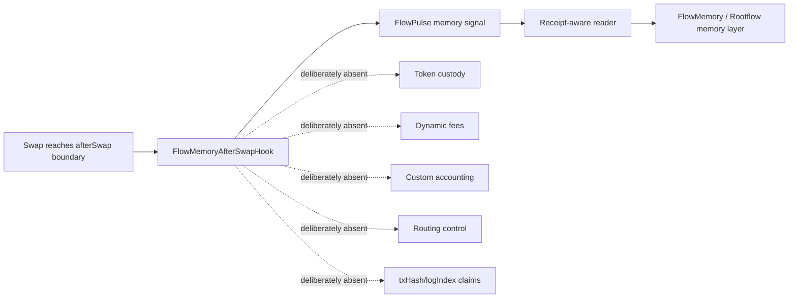
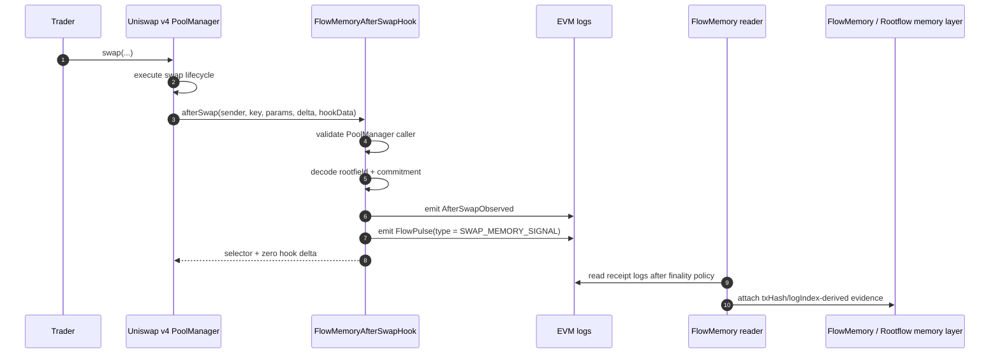

# FlowMemory Uniswap v4 Hooks

[](https://github.com/FlowmemoryAI/flowmemory-uniswap-v4-hooks/actions/workflows/ci.yml)

FlowMemory introduces the first memory-native Uniswap v4 hook primitive: a verified on-chain emission boundary for FlowPulse memory signals.

Most DeFi infrastructure is built around execution.

Swaps.
Settlement.
Liquidity.
Fees.
Routing.
Accounting.

FlowMemory adds the missing layer: memory.

This repository contains the first public FlowMemory hook surface: a Uniswap v4 `afterSwap` hook that emits FlowPulse memory signals after a completed swap boundary.

The swap transaction is not the memory.
The transaction is the proof envelope.
The FlowPulse is the memory artifact.

This is not a fee hook.
This is not a custody hook.
This is not a routing hook.
This is not a trading engine.

This is a memory hook.

## Start Here

```bash
python tools/flowmemory_release_transcript.py --pretty
```

Status:

```text
Local FMM-0 consistency surface: PASS
Public Base Sepolia receipt evidence: PENDING
Production verifier infrastructure: NOT_CLAIMED
```

## Launch Theorem

FlowMemory is not trying to make agents remember more. It is making impossible
memory states fail.

The launch path is intentionally narrow:

| Layer | Claim |
| --- | --- |
| Hook boundary | `afterSwap` is the verified on-chain emission boundary. |
| Memory artifact | `FlowPulse` is the memory signal emitted from that boundary. |
| Proof envelope | The transaction receipt proves where the signal landed. |
| Memory model | FMM-0 checks whether machine histories could have happened. |
| Runtime checks | FlowLitmus, witness packs, and adversarial tools catch impossible histories. |
| AI/GPU reuse | Cache and compute reuse stay blocked unless lineage and FMM-0 consistency pass. |
| Public evidence | Base Sepolia receipt evidence remains pending until a real release packet validates. |

That is the full claim surface:

```text
FlowPulse is the afterSwap memory artifact.
The transaction is the proof envelope.
FMM-0 is the memory consistency model.
Cache and compute reuse are allowed only when lineage and memory consistency pass.
```

## Public Reading Path

Read the repo in this order:

1. **Boundary**: the `afterSwap` hook emits `FlowPulse`; the swap is not the memory.
2. **FMM-0**: machine histories are checked as a memory consistency model.
3. **Forbidden histories**: FlowLitmus and adversarial harnesses catch histories that could not have happened.
4. **Reuse discipline**: cache and compute reuse are blocked unless lineage and FMM-0 consistency pass.
5. **Transcript**: one offline object shows what passed, what is pending, and what is not claimed.

Everything below is evidence for that path.

## Launch Reality Check

Run the launch-grade runtime consistency demo:

```bash
python tools/launch_reality_check.py --pretty
```

This command shows the FlowMemory boundary model, verifies the launch artifact surface, and runs the FlowLitmus forbidden-outcome suite.

Expected result:

```text
Result: FlowMemory can tell impossible histories from live ones using receipt-bound FlowPulse boundaries.
```

The three lines that matter:

```text
The swap is not the memory.
The transaction is the proof envelope.
The FlowPulse is the memory artifact.
```

See [docs/LAUNCH_REALITY_CHECK.md](docs/LAUNCH_REALITY_CHECK.md) and [examples/launch-reality-check/](examples/launch-reality-check/).

Launch copy, founder script, demo caption, and skeptic replies live in [docs/PUBLIC_LAUNCH_COPY.md](docs/PUBLIC_LAUNCH_COPY.md). The sprint-level launch summary lives in [docs/LAUNCH_SPRINT_SUMMARY.md](docs/LAUNCH_SPRINT_SUMMARY.md).

For a short reviewer path, start with [docs/REVIEWER_QUICKSTART.md](docs/REVIEWER_QUICKSTART.md).

For external technical review, send [docs/EXTERNAL_DEVELOPER_REVIEW_PACKET.md](docs/EXTERNAL_DEVELOPER_REVIEW_PACKET.md) or the printable PDF at [docs/EXTERNAL_DEVELOPER_REVIEW_PACKET.pdf](docs/EXTERNAL_DEVELOPER_REVIEW_PACKET.pdf).

For the public technical report, read [FLOWMEMORY_PUBLIC_TECHNICAL_REPORT.md](FLOWMEMORY_PUBLIC_TECHNICAL_REPORT.md) or the printable PDF at [FLOWMEMORY_PUBLIC_TECHNICAL_REPORT.pdf](FLOWMEMORY_PUBLIC_TECHNICAL_REPORT.pdf).

For launch-prep release notes, see [CHANGELOG.md](CHANGELOG.md).

## FMM-0: FlowMemory Agent Memory Model

Everyone treated agent memory like retrieval. FlowMemory treats it like a memory model.

FMM-0 is the launch model for this repo: a receipt-bound consistency model for machine histories anchored in FlowPulse boundaries.

It asks the question most AI-memory systems skip:

```text
Could this memory history have happened?
```

The Uniswap v4 hook is the public anchor:

```text
afterSwap boundary -> FlowPulse -> transaction receipt -> reader metadata -> serial history -> forbidden outcomes
```

FMM-0 is not a production standard, not semantic truth, and not a mainnet deployment claim. It is the local R&D model that makes the FlowMemory thesis concrete: memory for agents should have consistency rules, not only retrieval.

See [specs/FMM-0.v0.md](specs/FMM-0.v0.md), [docs/FLOWMEMORY_MEMORY_MODEL.md](docs/FLOWMEMORY_MEMORY_MODEL.md), and [docs/FMM_0_CONFORMANCE_MATRIX.md](docs/FMM_0_CONFORMANCE_MATRIX.md).

## Detailed Evidence Surfaces

The sections below are reviewer evidence, not separate launch theses.

### FMM-0 Phase Space

Everyone treated agent memory like retrieval. FlowMemory treats it like phase space.

The Reality Phase Table is the rendered view of FMM-0 Phase Space. It classifies machine artifacts by four axes:

- receipt stage: before receipt or after receipt;
- reality phase: speculative, live, quarantined, or extinct;
- operation surface: cite, act, forget, recompute, refuse, split, merge, publish;
- authority level: local-only, public-boundary, reader-derived, or FMM-0-conforming.

This gives FlowMemory a machine-state periodic table.

A local model output cannot jump directly into FMM-0-conforming live state.
A pre-receipt artifact cannot claim `txHash` or `logIndex`.
A reader-derived FlowPulse can become eligible for FlowSerial and FlowLitmus checks.
Receipt evidence alone is not FMM-0 live history; the history still has to pass consistency checks.

Run:

```bash
python tools/fmm0_phase_table.py demo --pretty
```

Expected result:

```text
FMM-0 treats machine memory as phase space, not retrieval text.
```

See [specs/FMM-0-PhaseTable.v0.md](specs/FMM-0-PhaseTable.v0.md), [docs/FMM_0_PHASE_TABLE.md](docs/FMM_0_PHASE_TABLE.md), and [examples/fmm0-phase-table/](examples/fmm0-phase-table/).

### FMM-0 Counterexample Forge

FlowMemory should not only pass examples.

It should catch counterexamples.

The FMM-0 Counterexample Forge mutates valid phase-space artifacts into
impossible histories and checks whether FMM-0 rejects them.

Run:

```bash
python tools/fmm0_counterexample_forge.py demo --pretty
```

Expected result:

```text
Generated counterexamples: 12
Caught by FMM-0: 12/12
Escaped: 0
```

This is the rigor layer: FMM-0 is not only a claim surface. It has adversarial
counterexamples.

See [specs/FMM-0-CounterexampleForge.v0.md](specs/FMM-0-CounterexampleForge.v0.md), [docs/FMM_0_COUNTEREXAMPLE_FORGE.md](docs/FMM_0_COUNTEREXAMPLE_FORGE.md), and [examples/fmm0-counterexample-forge/](examples/fmm0-counterexample-forge/).

### FMM-0 Closure Lab

Counterexamples prove that bad histories fail.

Closure proves the other half: valid memory histories can be composed without
leaving the model.

Run:

```bash
python tools/fmm0_closure_lab.py demo --pretty
```

Expected result:

```text
Closure laws checked: 8
Valid closures preserved: 4/4
Invalid closures rejected: 4/4
Escaped: 0
```

This is the memory-algebra layer: FMM-0 preserves matching receipt attachment,
consistency-gated promotion, monotonic append, and independent-rootfield merge,
while rejecting rollback, split-brain heads, pre-receipt receipt facts, and
semantic overclaims.

See [specs/FMM-0-ClosureLab.v0.md](specs/FMM-0-ClosureLab.v0.md), [docs/FMM_0_CLOSURE_LAB.md](docs/FMM_0_CLOSURE_LAB.md), and [examples/fmm0-closure-lab/](examples/fmm0-closure-lab/).

### FMM-0 Boundary Bisimulation

The boundary has to survive translation.

The hook emits a FlowPulse. The reader attaches receipt metadata. FMM-0 runtime
state cites the same proof envelope. Boundary Bisimulation checks that those are
the same boundary, not three similar-looking stories.

Run:

```bash
python tools/fmm0_boundary_bisim.py demo --pretty
```

Expected result:

```text
Projection checks: 8
Bisimulations preserved: 4/4
Drift cases rejected: 4/4
Escaped: 0
```

This is the cross-layer conformance layer: hook projection, receipt projection,
and runtime projection preserve FlowPulse boundary semantics, while rootfield
drift, commitment drift, receipt drift, and hook-time receipt metadata smuggling
are rejected.

See [specs/FMM-0-BoundaryBisimulation.v0.md](specs/FMM-0-BoundaryBisimulation.v0.md), [docs/FMM_0_BOUNDARY_BISIMULATION.md](docs/FMM_0_BOUNDARY_BISIMULATION.md), and [examples/fmm0-boundary-bisimulation/](examples/fmm0-boundary-bisimulation/).

### FMM-0 Forbidden Core Extractor

FMM-0 does not only catch impossible histories.

It can shrink them.

The Forbidden Core Extractor takes an invalid machine artifact or transition
and reduces it to a one-minimal set of boundary-state mutations that still
violates the model.

Run:

```bash
python tools/fmm0_forbidden_core.py demo --pretty
```

Expected result:

```text
minimal cores found: 10/10
one-minimal cores: 10/10
escaped faults: 0
```

This is the diagnostic layer: an integrator can see the smallest reason a
machine history is impossible instead of only seeing a generic invalid result.

See [specs/FMM-0-ForbiddenCore.v0.md](specs/FMM-0-ForbiddenCore.v0.md), [docs/FMM_0_FORBIDDEN_CORE_EXTRACTOR.md](docs/FMM_0_FORBIDDEN_CORE_EXTRACTOR.md), and [examples/fmm0-forbidden-core/](examples/fmm0-forbidden-core/).

### FMM-0 Witness Pack

The Witness Pack bundles the local conformance evidence into one reproducible
reviewer packet.

Run:

```bash
python tools/fmm0_witness_pack.py demo --pretty
```

Expected result:

```text
local conformance layers passed: 8/8
public Base Sepolia evidence: PENDING
escaped faults: 0
```

This is the evidence-quality layer: local FMM-0 conformance is reproducible,
while public Base Sepolia evidence remains pending until a real release packet
exists.

See [specs/FMM-0-WitnessPack.v0.md](specs/FMM-0-WitnessPack.v0.md), [docs/FMM_0_WITNESS_PACK.md](docs/FMM_0_WITNESS_PACK.md), and [examples/fmm0-witness-pack/](examples/fmm0-witness-pack/).

### FlowPulse Boundary ABI Gate

FMM-0 does not float above the hook.

The Boundary ABI Gate checks that the Solidity `FlowPulse` event, reader
projection, and runtime assumptions still describe the same boundary.

Run:

```bash
python tools/flowpulse_boundary_abi.py check --pretty
```

Expected result:

```text
ABI checks passed: 9/9
receipt-only fields exposed: 0
status: PASS
```

This is the ABI/model drift gate: `txHash`, `logIndex`, transaction index,
block facts, receipt status, and finality remain outside the hook-time event
surface.

See [specs/FlowPulse-BoundaryABI.v0.md](specs/FlowPulse-BoundaryABI.v0.md), [docs/FLOWPULSE_BOUNDARY_ABI.md](docs/FLOWPULSE_BOUNDARY_ABI.md), and [examples/flowpulse-boundary-abi/](examples/flowpulse-boundary-abi/).

### 10-Minute Skeptic Review

FlowMemory's launch claim is reviewable.

Run:

```bash
python tools/reviewer_walkthrough.py --pretty
```

This command walks through the repo like a skeptical engineer:

1. hook boundary claims;
2. non-interference claims;
3. receipt-separation claims;
4. FMM-0 runtime consistency claims;
5. public release evidence status.

Each claim maps to files, commands, expected outcomes, current status, and explicit non-claims.

Expected result:

```text
Local FMM-0 consistency surface: PASS
FlowLitmus forbidden outcomes: PASS
Public Base Sepolia receipt evidence: PENDING
Production verifier infrastructure: NOT_CLAIMED
```

Every launch claim has a command, and every overclaim has a red line.

See [docs/SKEPTIC_REVIEW_WALKTHROUGH.md](docs/SKEPTIC_REVIEW_WALKTHROUGH.md), [docs/LAUNCH_CLAIM_LEDGER.md](docs/LAUNCH_CLAIM_LEDGER.md), and [examples/reviewer-walkthrough/](examples/reviewer-walkthrough/).

### Base Sepolia Evidence Gate

Public testnet receipt evidence should be explicit, not implied.

Run:

```bash
python tools/verify_release_evidence.py --pretty
```

Current expected state until a real `releases/base-sepolia/RELEASE_EVIDENCE.json` packet exists:

```text
Public Base Sepolia receipt evidence: PENDING
Production verifier infrastructure: NOT_CLAIMED
```

The gate is pending-safe. It will not turn public evidence into `PASS` unless the release packet and referenced receipt/FlowPulse evidence files exist and validate.

See [releases/base-sepolia/README.md](releases/base-sepolia/README.md) and [releases/base-sepolia/RELEASE_EVIDENCE.template.json](releases/base-sepolia/RELEASE_EVIDENCE.template.json).

### Memory Consistency Card

Run the claim-to-evidence scorecard:

```bash
python tools/memory_consistency_card.py --pretty
```

This is the sharper AI-infrastructure framing:

```text
Agent memory should be checked like a consistency model, not retrieved like text.
```

The card maps the launch claim onto the repo's executable evidence:

- the Uniswap v4 `afterSwap` boundary;
- intentional FlowPulse emission;
- receipt metadata separation;
- reader-derived proof envelopes;
- FlowSerial receipt-linearizability;
- FlowLitmus forbidden outcomes;
- pending public Base Sepolia release evidence.

Safe launch claim:

```text
FlowMemory defines FMM-0, a receipt-bound memory consistency model for machine histories.
```

Most AI memory retrieves context. FlowMemory checks whether the memory could have happened.

See [docs/MEMORY_CONSISTENCY_CARD.md](docs/MEMORY_CONSISTENCY_CARD.md) and [examples/memory-consistency-card/](examples/memory-consistency-card/).

## The New Primitive: Memory Signals

FlowMemory introduces a new primitive: the memory signal.

A memory signal is not analytics.
It is not a dashboard.
It is not a post-hoc AI summary.
It is not transaction scraping.

A memory signal is an intentional protocol event emitted at a verifiable on-chain boundary.

A `FlowPulse` is not a transaction log in the ordinary sense. It is a structured memory signal emitted from a verified execution boundary. The hook does not interpret the swap as memory, scrape transaction history, or rely on an external analytics system to invent meaning after the fact.

The signal is emitted intentionally through explicit FlowMemory `hookData`:

- `rootfieldId`: the FlowMemory namespace receiving the signal;
- `commitment`: the opaque reference to the downstream memory artifact;
- `parentPulseId`: the optional prior memory signal being extended;
- `uri`: advisory metadata, not authority.

The hook emits the memory signal. The reader proves where it landed.

## Why afterSwap?

`afterSwap` is the right first boundary because execution has already happened.

FlowMemory does not need to control swap economics to make the moment memorable.

At this lifecycle point:

- the PoolManager has reached the post-swap callback boundary;
- the hook is not pricing, routing, custodying, or accounting for the swap;
- strict mode can reject malformed or missing memory payloads for pools that intentionally opt into this hook;
- the hook is not taking custody;
- the hook is not changing accounting;
- the hook is not routing order flow;
- the hook emits memory after the execution boundary exists.

The transaction is the proof envelope. The FlowPulse is the memory artifact.

## Why This Is Different

Most Uniswap v4 hooks are designed to change execution:

- fee logic;
- liquidity behavior;
- routing;
- incentives;
- custom accounting;
- MEV behavior;
- trading mechanics.

FlowMemory is different.

FlowMemory does not try to make the swap smarter.

FlowMemory makes the swap boundary memorable.

Most hooks ask: how can we change what the swap does?

FlowMemory asks: what should the system remember once execution has happened?

Most hooks modify execution. FlowMemory emits memory.



## Category Claim

FlowMemory is introducing a new category of Uniswap v4 hook: the memory-signal hook.

Traditional hook categories focus on execution changes: fees, routing, incentives, liquidity behavior, accounting, or trading mechanics.

FlowMemory's hook is different.

It is designed around verifiable memory emission.

The hook does not try to make the swap cheaper, faster, or more complex.

It makes the execution boundary memorable.

## Beyond The Hook

The Uniswap v4 hook is the first public edge of a larger category: memory for execution.

Execution is not enough. Systems need memory.

FlowMemory starts with DeFi because Uniswap v4 gives a clean public proof surface: a real lifecycle boundary, a real receipt, a real log, and a real artifact.

The same pattern can extend beyond DeFi:

- swaps can emit FlowPulse memory signals;
- GPU jobs can emit ComputePulse memory signals;
- KV/context reuse can emit CachePulse memory signals;
- model outputs can emit ModelPulse memory signals;
- autonomous workflows can emit AgentPulse memory trails;
- agents can cite proof-backed memory instead of vague internal context;
- Rootflow can connect execution memory across protocols, compute, and applications.

For DeFi:

```text
swap boundary -> FlowPulse -> transaction receipt -> memory artifact -> Rootflow graph
```

For AI compute:

```text
GPU job boundary -> ComputePulse -> compute receipt -> memory artifact -> Rootflow graph
```

GPUs compute. FlowMemory remembers.

The fastest GPU job is the one a system can prove it does not need to run again.

The Compute Reuse Router makes that claim executable. It routes a scheduler
request to `REUSE_PRIOR_COMPUTE` only when rootfield, model, input, runtime,
lineage, freshness, executor, hardware, and attestation policy checks pass.
Unsafe reuse is rejected with explicit proof failures.

Cache Lineage Gate goes one layer lower: it checks whether KV/context cache
reuse is safe when tokenizer, adapter, side input, runtime, or cache policy can
drift.

Compute Reuse Consistency ties the AI/GPU bridge back into the memory model:
safe reuse requires cache lineage, compute fingerprint compatibility, and
receipt-bound machine-history consistency.

For compute payments:

```text
payment requirement + compute route + FlowPulse memory head -> Compute ChargeLine -> CHARGE_ACCEPTED or REJECT_CHARGE
```

Compute ChargeLine checks whether payment for AI/GPU work matches the
memory-consistent compute route. It accepts fresh compute charged as fresh and
safe reuse charged as reuse. It rejects reuse charged as fresh, unsafe reuse
charged at all, fresh-compute policy laundering, duplicate charges, missing
attestation references, runtime drift, payment requirement drift, and stale
buyer memory heads.

Compute billing without memory consistency is invoice optimism.

For autonomous money movement:

```text
agent wallet + payment rail + FlowPulse memory head -> SpendLine -> ACCEPT_SPENDLINE or REJECT_SPENDLINE
```

SpendLine checks whether a declared agent spend can be accepted into a
receipt-bound memory history. It does not authorize wallets, custody funds, or
protect funds. It asks whether the spend is memory-linearizable: current head,
declared intent, post-spend FlowPulse, replay status, and FlowSerial ordering
must all agree.
SpendLine also rejects ignored AxiomPatch downgrades, x402 payment requirement
mismatches, and compute-reuse/payment drift.

For autonomous agent-to-agent exchange:

```text
buyer SpendLine + seller work memory + payment requirement -> DuplexLine -> ACCEPT_DUPLEXLINE or REJECT_DUPLEXLINE
```

DuplexLine checks whether the buyer's spend and the seller's work can be
co-serialized into one memory-consistent exchange. It does not escrow payments,
authorize wallets, prove work quality, or settle disputes. It asks whether both
sides of the exchange acted from compatible receipt-bound memory histories.
DuplexLine rejects wrong-task seller output, stale buyer memory, payment
requirement drift, missing seller FlowSerial evidence, and compute-reuse/payment
drift. It also rejects stale seller memory and duplicate buyer intent replay.
The hardened pass adds counterparty-payee binding, work replay rejection,
payment requirement consumption, buyer compute policy dominance, impossible
exchange schedule detection, payment receipt smuggling rejection, endpoint
drift rejection, and seller FMM-0 state checks.

For autonomous commerce episodes:

```text
obligations + closures + memory heads + compute/refusal state -> Agent Commerce Conservation -> CONSERVED or REJECT_CONSERVATION
```

Agent Commerce Conservation checks whether the whole episode balances. Wallets
can authorize a spend, payment rails can move value, and DuplexLine can prove a
buyer/seller exchange is co-serializable. Conservation Lab asks whether the
declared obligations actually conserved across spend, work, compute, refusal,
and receipt-bound memory state.

It rejects orphan payments, orphan work delivery, double-paid obligations,
double-delivered work, stale memory heads, unsafe compute reuse closing payment,
and rejected exchanges that fail to produce a refusal or repair state.

For multi-agent obligation supply chains:

```text
delegated obligations + child work/compute + rootfields + payee spine -> Obligation Membrane -> MEMBRANE_ACCEPTED or REJECTED
```

Obligation Membrane checks whether an obligation survives being passed through
subagents, compute providers, and aggregate work without laundering away its
memory constraints. Agent-to-agent work is not safe just because each step looks
valid locally. The chain has to preserve FMM-0 requirements, compute policy,
payee lineage, refusal state, rootfield boundaries, aggregation, and payment
ordering end to end.

It rejects downgraded FMM-0 requirements, fresh-compute laundering, missing
child obligations, broken payee spines, parent closure over open children,
swallowed refusals, rootfield drift, silent aggregation, and semantic upgrades.

```bash
python tools/cache_lineage_gate.py demo --pretty
python tools/compute_reuse_router.py demo --pretty
python tools/compute_reuse_consistency.py demo --pretty
python tools/compute_chargeline.py demo --pretty
python tools/spendline_harness.py demo --pretty
python tools/duplexline_harness.py demo --pretty
python tools/agent_commerce_conservation.py demo --pretty
python tools/obligation_membrane.py demo --pretty
```

Expected launch signal:

```text
cache reuse accepted: 1
unsafe cache reuse rejected: 4/4
prior compute reused: 1
GPU jobs avoided: 1
unsafe reuse rejected: 4/4
cases passed: 5/5
unsafe reuse blocked: 4/4
valid charges accepted: 2/2
invalid charges rejected: 8/8
valid spends accepted: 1/1
unsafe spends rejected: 8/8
valid exchanges accepted: 1/1
unsafe exchanges rejected: 15/15
valid episodes conserved: 1/1
invalid episodes rejected: 7/7
valid chains accepted: 1/1
unsafe chains rejected: 9/9
```

## Release Transcript

The release transcript is the canonical offline launch object. It gives a
reviewer one place to see what passed, what is pending, and what is explicitly
not claimed.

```bash
python tools/flowmemory_release_transcript.py --pretty
```

Expected launch line:

```text
FlowMemory's local FMM-0 consistency surface is launch-ready; public receipt evidence remains pending and is not claimed.
```

See [docs/BEYOND_DEFI_MEMORY.md](docs/BEYOND_DEFI_MEMORY.md), [docs/AGENT_COMMERCE_MEMORY.md](docs/AGENT_COMMERCE_MEMORY.md), [docs/AGENT_COMMERCE_CONSERVATION.md](docs/AGENT_COMMERCE_CONSERVATION.md), [docs/OBLIGATION_MEMBRANE.md](docs/OBLIGATION_MEMBRANE.md), [docs/CACHE_LINEAGE_GATE.md](docs/CACHE_LINEAGE_GATE.md), [docs/COMPUTE_PULSE.md](docs/COMPUTE_PULSE.md), [docs/COMPUTE_REUSE_CONSISTENCY.md](docs/COMPUTE_REUSE_CONSISTENCY.md), [docs/COMPUTE_REUSE_ROUTER.md](docs/COMPUTE_REUSE_ROUTER.md), [docs/COMPUTE_CHARGELINE.md](docs/COMPUTE_CHARGELINE.md), [docs/SPENDLINE.md](docs/SPENDLINE.md), [docs/DUPLEXLINE.md](docs/DUPLEXLINE.md), and [docs/PROOF_EXPLORER_CONCEPT.md](docs/PROOF_EXPLORER_CONCEPT.md).

## R&D Surfaces

These are lower-level experimental surfaces. They support the memory
consistency thesis, but the public launch should still lead with Boundary ->
FMM-0 -> forbidden histories -> reuse discipline -> transcript.

### AxiomPatch

AxiomPatch is proof-conditioned cognition for machine agents.

A FlowPulse is remembered.

An AxiomWrit is believed.

An AxiomPatch changes what an agent is allowed to believe, cite, reuse, downgrade, or do.

The key transition:

```text
submit_onchain_transaction -> propose_unsigned_action
```

That is not memory storage.

That is not a vector wrapper.

That is not a proof explorer.

It is a cognitive state transition derived from a receipt-bound FlowPulse proof envelope.

See [docs/AXIOM_PATCH.md](docs/AXIOM_PATCH.md), [specs/AxiomPatch.v0.md](specs/AxiomPatch.v0.md), and [examples/axiom-patch/](examples/axiom-patch/).

### BoundaryFission

BoundaryFission is proof-triggered forgetting.

Most AI-memory projects chase more context, more retrieval, more summaries, and more graphs.

FlowMemory asks a harder question:

What must an autonomous system forget once a verified execution boundary proves the world has changed?

A receipt-bound FlowPulse can rupture stale working memory into:

- conserved receipt-bound facts;
- ResidueAtoms that prove compression without retaining raw payloads;
- quarantined claims that the proof envelope does not support;
- BranchAsh for killed speculative on-chain action branches;
- delegated recompute tasks for fresh analysis from the current boundary.

This is not storage.

This is not indexing.

This is not RAG.

This is not a proof explorer.

It is memory physics for autonomous systems.

```text
receipt-bound FlowPulse
  -> BoundaryFission
  -> conserved facts
  -> ResidueAtoms
  -> quarantined claims
  -> BranchAsh
  -> delegated recompute
```

FlowMemory does not just help agents remember.

It gives agents proof-triggered forgetting.

See [docs/BOUNDARY_FISSION.md](docs/BOUNDARY_FISSION.md), [specs/BoundaryFission.v0.md](specs/BoundaryFission.v0.md), [specs/ResidueAtom.v0.md](specs/ResidueAtom.v0.md), and [examples/boundary-fission/](examples/boundary-fission/).

### PulseRetire Queue

PulseRetire Queue is receipt-driven retirement for speculative machine cognition.

AI agents and GPU workflows can compute ahead of the world. They can draft outputs, warm context, prepare next actions, and stage cache reuse before an external boundary has actually settled.

FlowMemory gives those artifacts a retirement discipline.

The agent can speculate. The receipt decides what becomes real.

```text
speculative model output
  -> PulseRetire Queue
  -> matching FlowPulse receipt?
      -> yes: retire into live agent state
      -> no: squash / withhold / recompute
```

The queued artifact can depend on `rootfieldId`, `commitment`, `hookAddress`, `subjectPoolId`, and `parentPulseId`.

It cannot smuggle `txHash`, `logIndex`, `transactionIndex`, or `blockHash` at enqueue time because the hook does not know those facts during execution.

When the reader later attaches receipt metadata to a matching FlowPulse, the artifact retires and receives a causal nonce. If the FlowPulse mismatches, the artifact is squashed.

FlowMemory gives AI agents a reorder buffer for reality: they can compute speculatively, but only receipt-bound FlowPulses can retire those thoughts into live action.

See [docs/PULSE_RETIRE.md](docs/PULSE_RETIRE.md), [specs/PulseRetire.v0.md](specs/PulseRetire.v0.md), and [examples/pulse-retire/](examples/pulse-retire/).

### FlowMMU

FlowMMU is receipt-backed virtual memory for machine reality.

FlowMemory gives agents a page fault for reality.

A machine can hold a virtual pointer to an expected FlowPulse boundary: `rootfieldId`, `commitment`, hook, pool, and optional parent pulse.

But it cannot read receipt facts like `txHash`, `logIndex`, receipt status, transaction index, or block hash until a reader maps that pointer using actual FlowPulse evidence.

```text
unmapped PulsePointer
  -> read txHash
  -> ReceiptPageFault
  -> map matching FlowPulse receipt
  -> ReceiptPage(read-only)
  -> read txHash succeeds
```

This is not memory storage.
This is not indexing.
This is not a dashboard.
This is not a policy gate.

It is a runtime primitive for external reality: agents can point at a boundary before proof exists, but they cannot dereference it until the receipt maps it.

See [docs/FLOW_MMU.md](docs/FLOW_MMU.md), [specs/FlowMMU.v0.md](specs/FlowMMU.v0.md), [specs/ReceiptPageFault.v0.md](specs/ReceiptPageFault.v0.md), and [examples/flow-mmu/](examples/flow-mmu/).

### FlowQuiesce

FlowQuiesce is receipt-triggered quiescence for autonomous agents and GPU workflows.

FlowMemory gives agents a grace period for reality.

A FlowPulse receipt advances a rootfield epoch. Any active agent or compute frame that read the old rootfield epoch must reach a safe point before its pending output can join post-boundary state.

```text
FlowPulse receipt
  -> ReceiptEpoch advances
  -> active pre-boundary readers are identified
  -> grace period opens
  -> required frames quiesce / revalidate / fork / abandon
  -> grace period closes
```

This is not workflow orchestration.
This is not action permission.
This is not cache invalidation.

It is a public safe-point protocol for machine cognition.

See [docs/FLOW_QUIESCE.md](docs/FLOW_QUIESCE.md), [specs/FlowQuiesce.v0.md](specs/FlowQuiesce.v0.md), and [examples/flow-quiesce/](examples/flow-quiesce/).

### FlowSerial

FlowSerial is receipt-linearizability for machine cognition.

FlowMemory gives agents linearizability against reality.

AI agents are becoming distributed systems: model calls, tools, background workers, cache reuse, GPU jobs, planner loops, and state writers all produce machine history. The dangerous failure is not only hallucination. It is impossible history.

FlowSerial asks:

```text
Can this agent history be serialized around the FlowPulse receipt boundaries it claims to have observed?
```

If yes, FlowSerial emits a deterministic certificate with a serial schedule.

If no, FlowSerial emits a typed impossibility fault:

- retrocausal receipt claim;
- rootfield rollback;
- split-brain write;
- missing receipt metadata;
- failed receipt boundary;
- impossible schedule.

This is not memory storage.
This is not retrieval.
This is not a proof explorer.
This is not a workflow engine.
This is not semantic truth.

It is linearizability against reality for autonomous systems.

```text
machine history
  -> FlowSerial
  -> serializable schedule
     or
  -> impossible history fault
```

A model can generate a story. FlowSerial decides whether that story could have happened.

See [docs/FLOW_SERIAL.md](docs/FLOW_SERIAL.md), [specs/FlowSerial.v0.md](specs/FlowSerial.v0.md), and [examples/flow-serial/](examples/flow-serial/).

### FlowLitmus

FlowLitmus is an executable runtime consistency suite for FlowMemory.

FlowMemory does not just give agents memory. It gives them forbidden outcomes.

The FlowMemory hook emits a FlowPulse at a Uniswap v4 `afterSwap` boundary. The swap is not the memory. The transaction is the proof envelope. The FlowPulse is the memory artifact. The hook does not know `txHash` or `logIndex` during execution; reader/verifier infrastructure attaches receipt metadata later.

FlowLitmus turns that boundary model into runtime tests.

It runs adversarial agent histories and checks whether the runtime catches impossible states:

- reading `txHash` before receipt mapping;
- claiming `logIndex` before the receipt exists;
- publishing unquiesced output after a boundary;
- releasing speculative output before retirement;
- allowing stale model output to survive boundary fission;
- rolling back a rootfield head;
- split-brain canonical writes.

```bash
python tools/flow_litmus.py run --suite examples/flow-litmus/litmus.manifest.json
```

Expected:

```text
FlowLitmus Runtime Consistency Suite
8/8 passed
```

This is not memory storage.
This is not retrieval.
This is not a proof explorer.
This is not a dashboard.
This is not a workflow engine.

FlowLitmus is a conformance suite for reality.

The forbidden-outcomes casebook explains each impossible history in plain engineering language:

```bash
python tools/render_flowlitmus_casebook.py --check
```

See [docs/FLOWLITMUS_LAUNCH_DEMO.md](docs/FLOWLITMUS_LAUNCH_DEMO.md), [docs/FLOWLITMUS_FORBIDDEN_OUTCOMES.md](docs/FLOWLITMUS_FORBIDDEN_OUTCOMES.md), [docs/FLOWMEMORY_RUNTIME_MODEL.md](docs/FLOWMEMORY_RUNTIME_MODEL.md), [specs/FlowLitmus.v0.md](specs/FlowLitmus.v0.md), and [examples/flow-litmus/](examples/flow-litmus/).

## What This Is

- A memory-native Uniswap v4 hook primitive.
- A verified on-chain emission boundary for FlowPulse signals.
- A protocol-level memory signal surface.
- The first public FlowMemory hook reference.
- A live-prep artifact for memory-native DeFi infrastructure.

## What This Is Not

- Not a custody system.
- Not a token.
- Not a fee engine.
- Not a routing engine.
- Not a swap-economics engine.
- Not transaction scraping.
- Not analytics after the fact.
- Not an AI summary layer.
- Not a claim that the swap transaction itself is memory.

## Developer Mental Model

1. A FlowMemory-enabled swap flow provides `hookData`.
2. The Uniswap v4 PoolManager completes the swap lifecycle step.
3. The PoolManager calls `afterSwap`.
4. `FlowMemoryAfterSwapHook` validates the caller.
5. The hook decodes `rootfieldId`, `commitment`, `parentPulseId`, and `uri`.
6. The hook emits `AfterSwapObserved`.
7. The hook emits `FlowPulse`.
8. The hook returns the `afterSwap` selector and zero hook delta.
9. A reader later attaches receipt metadata.
10. Downstream FlowMemory / Rootflow systems can use the pulse as the memory artifact.



## Contract Invariants

The hook is deliberately minimal because the primitive is not execution control. The primitive is verifiable memory emission.

| Property | Why it matters |
| --- | --- |
| `afterSwap` only | Keeps the Uniswap v4 permission surface small and auditable. |
| PoolManager-gated callback | Prevents arbitrary callers from fabricating swap memory signals through the hook callback. |
| `hookData` required | Makes memory emission intentional, not automatic transaction scraping. |
| `rootfieldId` required | Every signal names a FlowMemory namespace. |
| `commitment` required | Every signal points to an opaque downstream memory artifact. |
| `sender` required | The actor field is explicit, while still allowing routers or contract senders. |
| Zero hook delta | Avoids custom accounting and token balance side effects. |
| No custody path | The hook emits memory; it does not hold user assets. |
| No dynamic-fee path | The hook is not a fee controller. |
| Receipt metadata excluded | `txHash`, `transactionIndex`, and `logIndex` are reader-derived after the transaction is mined. |
| CREATE2 planning | The hook address can be mined to match the v4 `afterSwap` permission bit. |

Strict payload validation is intentional. For pools that opt into this hook, malformed or missing FlowMemory `hookData` is rejected because the primitive is not passive analytics. It is explicit memory emission from a verified boundary.

## Repository Map

```text
contracts/
  FlowMemoryAfterSwapHook.sol      # Memory-native afterSwap emission boundary
  FlowMemoryHookPlanner.sol        # Hook flag helpers and Base Sepolia CREATE2 planner
  FlowPulse.sol                    # FlowPulse memory signal schema and pulse type ids
  interfaces/
    IFlowMemoryHookData.sol        # Encoded FlowMemory hook-data shape
    IUniswapV4SwapHookLike.sol     # Minimal ABI-compatible v4 afterSwap surface
test/
  FlowMemoryAfterSwapHook.t.sol    # Dependency-light Foundry tests
docs/
  ARCHITECTURE.md                  # Execution, emission, evidence, and memory layers
  UNISWAP_V4_COMPATIBILITY.md      # ABI, hook flag, and upstream compatibility assumptions
  WHY_IT_WORKS.md                  # Why the hook creates a new primitive
  EVENT_MODEL.md                   # FlowPulse artifact and reader-derived receipt metadata
  BEYOND_DEFI_MEMORY.md            # Larger FlowMemory thesis across DeFi, AI, GPU work, and agents
  AGENT_COMMERCE_MEMORY.md         # Memory-native commerce model for Base agents
  CACHE_LINEAGE_GATE.md            # Proof-carried KV/context reuse gate
  COMPUTE_PULSE.md                 # ComputePulse architecture for AI/GPU memory artifacts
  COMPUTE_REUSE_CONSISTENCY.md     # Cache, compute, and receipt-history reuse harness
  COMPUTE_REUSE_ROUTER.md          # Proof-backed scheduler decisions for reusable compute
  COMPUTE_CHARGELINE.md            # Compute payment follows the memory-consistent route
  SPENDLINE.md                     # Memory-linearizable autonomous spend histories
  DUPLEXLINE.md                    # Co-serializable buyer/seller agent exchange
  AGENT_COMMERCE_CONSERVATION.md   # Obligation conservation for autonomous commerce episodes
  OBLIGATION_MEMBRANE.md           # No obligation laundering through multi-agent supply chains
  PROOF_EXPLORER_CONCEPT.md        # Launch-grade FlowPulse proof explorer concept
  READER_VERIFIER_ARCHITECTURE.md  # Reader, receipt, finality, and verifier pipeline
  INTEGRATION_BLUEPRINT.md         # How the hook connects to FlowMemory / Rootflow systems
  SECURITY_MODEL.md                # Threat model, invariants, non-goals
  AXIOM_WRIT.md                    # AxiomWrit proof-conditioned cognition R&D primitive
  AXIOM_PATCH.md                   # AxiomPatch operational cognitive state transition
  BOUNDARY_FISSION.md              # Proof-triggered forgetting and memory release
  PULSE_RETIRE.md                  # Receipt-driven retirement for speculative cognition
  FLOW_MMU.md                      # Receipt-backed dereference semantics for agents
  FLOW_QUIESCE.md                  # Receipt-triggered quiescence epochs for agent runtimes
  FLOW_SERIAL.md                   # Receipt-linearizability for machine cognition
  FLOWMEMORY_RELEASE_TRANSCRIPT.md # Canonical offline launch transcript
  FLOWMEMORY_RUNTIME_MODEL.md      # Runtime rules and forbidden outcomes
  FLOWLITMUS_LAUNCH_DEMO.md        # Executable launch demo for runtime consistency
  FLOWLITMUS_FORBIDDEN_OUTCOMES.md # Casebook for each impossible history
  LAUNCH_REALITY_CHECK.md          # One-command launch screenshot guide
  FLOWMEMORY_MEMORY_MODEL.md       # FMM-0 memory model overview
  FMM_0_CONFORMANCE_MATRIX.md      # Generated FMM-0 rule/evidence matrix
  SKEPTIC_REVIEW_WALKTHROUGH.md    # 10-minute claim-to-evidence review path
  LAUNCH_CLAIM_LEDGER.md           # Claim status, commands, and non-claims
  EXTERNAL_DEVELOPER_REVIEW_PACKET.md # Simple plus technical packet for external review
  EXTERNAL_DEVELOPER_REVIEW_PACKET.pdf # Printable external review packet
  MEMORY_CONSISTENCY_CARD.md       # Claim-to-evidence consistency scorecard
  LAUNCH_SPRINT_SUMMARY.md         # Launch package summary and remaining evidence gaps
  PUBLIC_LAUNCH_COPY.md            # Public launch post, founder script, and skeptic replies
  REVIEWER_QUICKSTART.md           # Short path through the launch evidence stack
  ARCHITECTURE_DECISIONS.md        # ADR-style design records
  PUBLIC_RELEASE_PATH.md           # Base Sepolia and public launch evidence path
  PUBLIC_REVIEW_CHECKLIST.md       # Share/deploy/mainnet review gates
  BASE_SEPOLIA_PLAN.md             # Concrete Base Sepolia planning facts
  BASE_SEPOLIA_OPERATOR_RUNBOOK.md # Operator path from deployment to proof
  BASE_SEPOLIA_RELEASE_RECORD_TEMPLATE.md
  LAUNCH_ARTIFACT_AUDIT.md         # Prompt-to-artifact launch readiness map
  LAUNCH_DAY_CHECKLIST.md          # May 19 launch checks
  PUBLIC_CANARY_TEMPLATE.md        # Public Base Sepolia evidence announcement template
  MARKETING_POSITIONING.md         # Founder script, category language, and one-liners
  OFFICIAL_REFERENCES.md           # Upstream Uniswap docs and address assumptions
  EXPERT_REVIEW_PROMPT.md          # Prompt for external LLM/human architecture review
  HOW_IT_WORKS.md                  # Direct code-level walkthrough
  PROOF_CARRIED_AGENT_MEMORY.md    # R&D direction for proof-backed AI-agent memory
tools/
  read_flowpulse_logs.py           # Dependency-light receipt-aware log reader
  memory_trace.py                  # Builds proof-carried Agent Memory Packs from traces
  cache_lineage_gate.py            # Gates KV/context reuse through lineage commitments
  compute_reuse_consistency.py     # Tests cache, compute, and receipt-history reuse gates
  compute_reuse_router.py          # Routes safe reuse of committed AI/GPU work
  compute_chargeline.py            # Checks compute payment against the compute route
  spendline_harness.py             # Checks autonomous spend history consistency
  duplexline_harness.py            # Checks buyer/seller exchange consistency
  agent_commerce_conservation.py   # Checks obligation conservation across agent commerce episodes
  obligation_membrane.py           # Checks delegated obligation chains for laundering
  flowmemory_release_transcript.py # Builds the canonical offline launch transcript
  public_claim_gate.py             # Checks public launch copy for unguarded overclaims
  axiom_writ.py                    # Mints/verifies/applies AxiomWrit cognitive permissions
  axiom_patch.py                   # Applies AxiomPatch allow/deny/downgrade decisions
  boundary_fission.py              # Applies proof-triggered working-memory fission
  pulse_retire.py                  # Retires or squashes speculative artifacts with FlowPulse receipts
  flow_mmu.py                      # Maps virtual FlowPulse pointers into read-only receipt pages
  flow_quiesce.py                  # Requires active pre-boundary frames to quiesce after FlowPulse receipts
  flow_serial.py                   # Compiles machine histories into serial schedules or typed faults
  flow_litmus.py                   # Runs executable forbidden-outcome cases across R&D tools
  launch_reality_check.py          # Screenshot-ready launch harness around FlowLitmus
  memory_consistency_card.py       # Maps launch claims to executable consistency evidence
  render_fmm0_matrix.py            # Renders the FMM-0 conformance matrix
  reviewer_walkthrough.py          # Renders the launch claim ledger for skeptics
  verify_release_evidence.py       # Pending-safe Base Sepolia evidence gate
  render_flowlitmus_casebook.py    # Renders forbidden-outcome case explanations
specs/
  FMM-0.v0.md                      # Draft FlowMemory Agent Memory Model
  FlowPulse.v1.md                  # Draft public FlowPulse artifact spec
  CacheLineageGate.v0.md           # Draft proof-carried KV/context reuse gate spec
  ComputePulse.v0.md               # Draft AI/GPU ComputePulse spec
  ComputeReuseConsistency.v0.md    # Draft cache/compute/history reuse consistency spec
  ComputeReuseRouter.v0.md         # Draft scheduler-facing compute reuse spec
  ComputeChargeLine.v0.md          # Draft compute payment consistency spec
  SpendLine.v0.md                  # Draft autonomous spend history consistency spec
  DuplexLine.v0.md                 # Draft buyer/seller exchange consistency spec
  AgentCommerceConservation.v0.md  # Draft obligation-conservation spec for agent commerce
  ObligationMembrane.v0.md         # Draft multi-agent obligation membrane spec
  FlowMemoryReleaseTranscript.v0.md # Draft offline release transcript spec
  MachineMemoryTrace.v0.md         # Draft trace format across pulse artifacts
  AgentMemoryPack.v0.md            # Draft proof-carried agent memory pack spec
  AxiomWrit.v0.md                  # Draft proof-conditioned belief object spec
  CognitivePolicy.v0.md            # Draft policy mapping proof tier to cognitive verbs
  AxiomPatch.v0.md                 # Draft proof-conditioned cognitive state transition
  BoundaryFission.v0.md            # Draft proof-triggered memory release spec
  ResidueAtom.v0.md                # Draft compression residue spec
  PulseRetire.v0.md                # Draft receipt-driven speculative retirement spec
  FlowMMU.v0.md                    # Draft receipt-backed virtual memory spec
  ReceiptPageFault.v0.md           # Draft runtime fault spec for early receipt reads
  FlowQuiesce.v0.md                # Draft receipt-triggered quiescence epoch spec
  FlowSerial.v0.md                 # Draft receipt-linearizable machine history spec
  FlowLitmus.v0.md                 # Draft forbidden-outcome suite spec
examples/
  pulse-trace/                     # Example FlowPulse -> ComputePulse -> ModelPulse trace
  cache-lineage-gate/              # Example proof-carried KV/context reuse decision
  compute-reuse-router/            # Example proof-backed GPU workflow reuse decision
  compute-reuse-consistency/       # Example cache + compute + history consistency harness
  compute-chargeline/              # Example compute payment consistency harness
  spendline/                       # Example memory-linearizable agent spend harness
  duplexline/                      # Example co-serializable buyer/seller exchange harness
  agent-commerce-conservation/     # Example obligation conservation harness
  obligation-membrane/             # Example multi-agent obligation membrane harness
  release-transcript/              # Example canonical launch transcript output
  axiom-writ/                      # Example FlowPulse -> AxiomWrit -> cognition verdicts
  axiom-patch/                     # Example FlowPulse -> AxiomPatch -> downgraded agent action
  boundary-fission/                # Example FlowPulse -> memory release products
  pulse-retire/                    # Example speculative artifacts -> FlowPulse retirement
  flow-mmu/                        # Example PulsePointer -> ReceiptPageFault -> ReceiptPage
  flow-quiesce/                    # Example active frame -> quiescence request -> certificate
  flow-serial/                     # Example history -> serial certificate or impossibility fault
  flow-litmus/                     # Executable runtime consistency suite
  flow-litmus/flowlitmus-casebook.json
  launch-reality-check/            # Screenshot guide and expected launch output
  memory-model/                    # FMM-0 manifest and conformance matrix inputs
  reviewer-walkthrough/            # Claim ledger and expected skeptic output
  memory-consistency-card/          # Claim-to-evidence card output
releases/
  base-sepolia/README.md           # Staging area for public release evidence
  base-sepolia/RELEASE_EVIDENCE.template.json
  base-sepolia/expected-pending-output.txt
```

Root files:

```text
CHANGELOG.md                       # Launch-prep release notes and non-claims
FLOWMEMORY_PUBLIC_TECHNICAL_REPORT.md # Public technical report source
FLOWMEMORY_PUBLIC_TECHNICAL_REPORT.pdf # Printable public technical report
README.md                          # Public project landing page
LICENSE                            # MIT license
```

## Run It

Install [Foundry](https://book.getfoundry.sh/), then:

```bash
forge test -vvv
```

Targeted checks:

```bash
forge test --match-test testAfterSwapHookEmitsFlowPulseAndReturnsZeroHookDelta -vvv
forge test --match-test testPlannerMinesBaseSepoliaCreate2AddressWithTargetFlags -vvv
forge test --match-test testAfterSwapHookIsPoolManagerGated -vvv
```

Expected local result:

```text
Ran 12 tests for test/FlowMemoryAfterSwapHook.t.sol:FlowMemoryAfterSwapHookTest
Suite result: ok. 12 passed; 0 failed; 0 skipped
```

## Public Release Boundary

This repository is the first public FlowMemory hook surface and the live-prep package for the memory-native hook primitive.

A real live release requires a separate release record with:

- chain id;
- PoolManager address;
- deployer address;
- constructor args;
- init code hash;
- mined salt;
- computed hook address;
- deployment transaction hash;
- source verification URL;
- reader block range;
- observed `AfterSwapObserved` logs;
- observed `FlowPulse` logs;
- explicit statement that receipt metadata is reader-derived.

See [docs/PUBLIC_RELEASE_PATH.md](docs/PUBLIC_RELEASE_PATH.md).

## External References

- [Uniswap v4 hooks concept documentation](https://developers.uniswap.org/contracts/v4/concepts/hooks)
- [Uniswap v4 swap hooks quickstart](https://developers.uniswap.org/contracts/v4/quickstart/hooks/swap)
- [Uniswap v4 hook deployment documentation](https://developers.uniswap.org/docs/protocols/v4/guides/hooks/hook-deployment)
- [Uniswap v4 PoolManager interface documentation](https://developers.uniswap.org/contracts/v4/reference/core/interfaces/IPoolManager)

## Status

This repo is public, runnable, and CI-tested. It is the first public primitive in the FlowMemory hook path.

It is not a production Base mainnet deployment claim.
