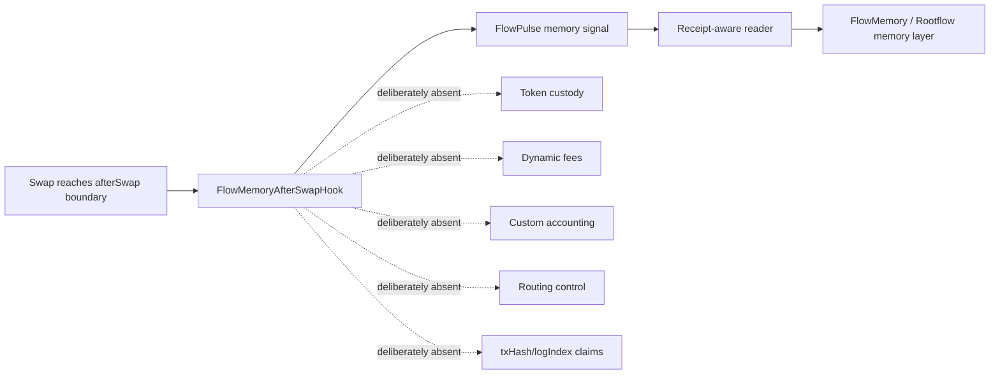
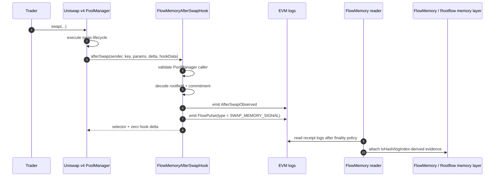

# FlowMemory Uniswap v4 Hooks

[](https://github.com/FlowmemoryAI/flowmemory-uniswap-v4-hooks/actions/workflows/ci.yml)

FlowMemory introduces the first memory-native Uniswap v4 hook primitive: a verified on-chain emission boundary for FlowPulse memory signals.

Most DeFi infrastructure is built around execution.

Swaps.
Settlement.
Liquidity.
Fees.
Routing.
Accounting.

FlowMemory adds the missing layer: memory.

This repository contains the first public FlowMemory hook surface: a Uniswap v4 `afterSwap` hook that emits FlowPulse memory signals after a completed swap boundary.

The swap transaction is not the memory.
The transaction is the proof envelope.
The FlowPulse is the memory artifact.

This is not a fee hook.
This is not a custody hook.
This is not a routing hook.
This is not a trading engine.

This is a memory hook.

## The New Primitive: Memory Signals

FlowMemory introduces a new primitive: the memory signal.

A memory signal is not analytics.
It is not a dashboard.
It is not a post-hoc AI summary.
It is not transaction scraping.

A memory signal is an intentional protocol event emitted at a verifiable on-chain boundary.

A `FlowPulse` is not a transaction log in the ordinary sense. It is a structured memory signal emitted from a verified execution boundary. The hook does not interpret the swap as memory, scrape transaction history, or rely on an external analytics system to invent meaning after the fact.

The signal is emitted intentionally through explicit FlowMemory `hookData`:

- `rootfieldId`: the FlowMemory namespace receiving the signal;
- `commitment`: the opaque reference to the downstream memory artifact;
- `parentPulseId`: the optional prior memory signal being extended;
- `uri`: advisory metadata, not authority.

The hook emits the memory signal. The reader proves where it landed.

## Why afterSwap?

`afterSwap` is the right first boundary because execution has already happened.

FlowMemory does not need to control swap economics to make the moment memorable.

At this lifecycle point:

- the PoolManager has reached the post-swap callback boundary;
- the hook is not pricing, routing, custodying, or accounting for the swap;
- strict mode can reject malformed or missing memory payloads for pools that intentionally opt into this hook;
- the hook is not taking custody;
- the hook is not changing accounting;
- the hook is not routing order flow;
- the hook emits memory after the execution boundary exists.

The transaction is the proof envelope. The FlowPulse is the memory artifact.

## Why This Is Different

Most Uniswap v4 hooks are designed to change execution:

- fee logic;
- liquidity behavior;
- routing;
- incentives;
- custom accounting;
- MEV behavior;
- trading mechanics.

FlowMemory is different.

FlowMemory does not try to make the swap smarter.

FlowMemory makes the swap boundary memorable.

Most hooks ask: how can we change what the swap does?

FlowMemory asks: what should the system remember once execution has happened?

Most hooks modify execution. FlowMemory emits memory.



## Category Claim

FlowMemory is introducing a new category of Uniswap v4 hook: the memory-signal hook.

Traditional hook categories focus on execution changes: fees, routing, incentives, liquidity behavior, accounting, or trading mechanics.

FlowMemory's hook is different.

It is designed around verifiable memory emission.

The hook does not try to make the swap cheaper, faster, or more complex.

It makes the execution boundary memorable.

## Beyond The Hook

The Uniswap v4 hook is the first public edge of a larger category: memory for execution.

Execution is not enough. Systems need memory.

FlowMemory starts with DeFi because Uniswap v4 gives a clean public proof surface: a real lifecycle boundary, a real receipt, a real log, and a real artifact.

The same pattern can extend beyond DeFi:

- swaps can emit FlowPulse memory signals;
- GPU jobs can emit ComputePulse memory signals;
- KV/context reuse can emit CachePulse memory signals;
- model outputs can emit ModelPulse memory signals;
- autonomous workflows can emit AgentPulse memory trails;
- agents can cite proof-backed memory instead of vague internal context;
- Rootflow can connect execution memory across protocols, compute, and applications.

For DeFi:

```text
swap boundary -> FlowPulse -> transaction receipt -> memory artifact -> Rootflow graph
```

For AI compute:

```text
GPU job boundary -> ComputePulse -> compute receipt -> memory artifact -> Rootflow graph
```

GPUs compute. FlowMemory remembers.

The fastest GPU job is the one a system can prove it does not need to run again.

See [docs/BEYOND_DEFI_MEMORY.md](docs/BEYOND_DEFI_MEMORY.md), [docs/COMPUTE_PULSE.md](docs/COMPUTE_PULSE.md), and [docs/PROOF_EXPLORER_CONCEPT.md](docs/PROOF_EXPLORER_CONCEPT.md).

## R&D Primitive: AxiomPatch

AxiomPatch is proof-conditioned cognition for machine agents.

A FlowPulse is remembered.

An AxiomWrit is believed.

An AxiomPatch changes what an agent is allowed to believe, cite, reuse, downgrade, or do.

The key transition:

```text
submit_onchain_transaction -> propose_unsigned_action
```

That is not memory storage.

That is not a vector wrapper.

That is not a proof explorer.

It is a cognitive state transition derived from a receipt-bound FlowPulse proof envelope.

See [docs/AXIOM_PATCH.md](docs/AXIOM_PATCH.md), [specs/AxiomPatch.v0.md](specs/AxiomPatch.v0.md), and [examples/axiom-patch/](examples/axiom-patch/).

## Frontier R&D Primitive: BoundaryFission

BoundaryFission is proof-triggered forgetting.

Most AI-memory projects chase more context, more retrieval, more summaries, and more graphs.

FlowMemory asks a harder question:

What must an autonomous system forget once a verified execution boundary proves the world has changed?

A receipt-bound FlowPulse can rupture stale working memory into:

- conserved receipt-bound facts;
- ResidueAtoms that prove compression without retaining raw payloads;
- quarantined claims that the proof envelope does not support;
- BranchAsh for killed speculative on-chain action branches;
- delegated recompute tasks for fresh analysis from the current boundary.

This is not storage.

This is not indexing.

This is not RAG.

This is not a proof explorer.

It is memory physics for autonomous systems.

```text
receipt-bound FlowPulse
  -> BoundaryFission
  -> conserved facts
  -> ResidueAtoms
  -> quarantined claims
  -> BranchAsh
  -> delegated recompute
```

FlowMemory does not just help agents remember.

It gives agents proof-triggered forgetting.

See [docs/BOUNDARY_FISSION.md](docs/BOUNDARY_FISSION.md), [specs/BoundaryFission.v0.md](specs/BoundaryFission.v0.md), [specs/ResidueAtom.v0.md](specs/ResidueAtom.v0.md), and [examples/boundary-fission/](examples/boundary-fission/).

## What This Is

- A memory-native Uniswap v4 hook primitive.
- A verified on-chain emission boundary for FlowPulse signals.
- A protocol-level memory signal surface.
- The first public FlowMemory hook reference.
- A live-prep artifact for memory-native DeFi infrastructure.

## What This Is Not

- Not a custody system.
- Not a token.
- Not a fee engine.
- Not a routing engine.
- Not a swap-economics engine.
- Not transaction scraping.
- Not analytics after the fact.
- Not an AI summary layer.
- Not a claim that the swap transaction itself is memory.

## Developer Mental Model

1. A FlowMemory-enabled swap flow provides `hookData`.
2. The Uniswap v4 PoolManager completes the swap lifecycle step.
3. The PoolManager calls `afterSwap`.
4. `FlowMemoryAfterSwapHook` validates the caller.
5. The hook decodes `rootfieldId`, `commitment`, `parentPulseId`, and `uri`.
6. The hook emits `AfterSwapObserved`.
7. The hook emits `FlowPulse`.
8. The hook returns the `afterSwap` selector and zero hook delta.
9. A reader later attaches receipt metadata.
10. Downstream FlowMemory / Rootflow systems can use the pulse as the memory artifact.



## Contract Invariants

The hook is deliberately minimal because the primitive is not execution control. The primitive is verifiable memory emission.

| Property | Why it matters |
| --- | --- |
| `afterSwap` only | Keeps the Uniswap v4 permission surface small and auditable. |
| PoolManager-gated callback | Prevents arbitrary callers from fabricating swap memory signals through the hook callback. |
| `hookData` required | Makes memory emission intentional, not automatic transaction scraping. |
| `rootfieldId` required | Every signal names a FlowMemory namespace. |
| `commitment` required | Every signal points to an opaque downstream memory artifact. |
| `sender` required | The actor field is explicit, while still allowing routers or contract senders. |
| Zero hook delta | Avoids custom accounting and token balance side effects. |
| No custody path | The hook emits memory; it does not hold user assets. |
| No dynamic-fee path | The hook is not a fee controller. |
| Receipt metadata excluded | `txHash`, `transactionIndex`, and `logIndex` are reader-derived after the transaction is mined. |
| CREATE2 planning | The hook address can be mined to match the v4 `afterSwap` permission bit. |

Strict payload validation is intentional. For pools that opt into this hook, malformed or missing FlowMemory `hookData` is rejected because the primitive is not passive analytics. It is explicit memory emission from a verified boundary.

## Repository Map

```text
contracts/
  FlowMemoryAfterSwapHook.sol      # Memory-native afterSwap emission boundary
  FlowMemoryHookPlanner.sol        # Hook flag helpers and Base Sepolia CREATE2 planner
  FlowPulse.sol                    # FlowPulse memory signal schema and pulse type ids
  interfaces/
    IFlowMemoryHookData.sol        # Encoded FlowMemory hook-data shape
    IUniswapV4SwapHookLike.sol     # Minimal ABI-compatible v4 afterSwap surface
test/
  FlowMemoryAfterSwapHook.t.sol    # Dependency-light Foundry tests
docs/
  ARCHITECTURE.md                  # Execution, emission, evidence, and memory layers
  UNISWAP_V4_COMPATIBILITY.md      # ABI, hook flag, and upstream compatibility assumptions
  WHY_IT_WORKS.md                  # Why the hook creates a new primitive
  EVENT_MODEL.md                   # FlowPulse artifact and reader-derived receipt metadata
  BEYOND_DEFI_MEMORY.md            # Larger FlowMemory thesis across DeFi, AI, GPU work, and agents
  COMPUTE_PULSE.md                 # ComputePulse architecture for AI/GPU memory artifacts
  PROOF_EXPLORER_CONCEPT.md        # Launch-grade FlowPulse proof explorer concept
  READER_VERIFIER_ARCHITECTURE.md  # Reader, receipt, finality, and verifier pipeline
  INTEGRATION_BLUEPRINT.md         # How the hook connects to FlowMemory / Rootflow systems
  SECURITY_MODEL.md                # Threat model, invariants, non-goals
  AXIOM_WRIT.md                    # AxiomWrit proof-conditioned cognition R&D primitive
  AXIOM_PATCH.md                   # AxiomPatch operational cognitive state transition
  BOUNDARY_FISSION.md              # Proof-triggered forgetting and memory release
  ARCHITECTURE_DECISIONS.md        # ADR-style design records
  PUBLIC_RELEASE_PATH.md           # Base Sepolia and public launch evidence path
  PUBLIC_REVIEW_CHECKLIST.md       # Share/deploy/mainnet review gates
  BASE_SEPOLIA_PLAN.md             # Concrete Base Sepolia planning facts
  BASE_SEPOLIA_OPERATOR_RUNBOOK.md # Operator path from deployment to proof
  BASE_SEPOLIA_RELEASE_RECORD_TEMPLATE.md
  LAUNCH_ARTIFACT_AUDIT.md         # Prompt-to-artifact launch readiness map
  LAUNCH_DAY_CHECKLIST.md          # May 19 launch checks
  PUBLIC_CANARY_TEMPLATE.md        # Public Base Sepolia evidence announcement template
  MARKETING_POSITIONING.md         # Founder script, category language, and one-liners
  OFFICIAL_REFERENCES.md           # Upstream Uniswap docs and address assumptions
  EXPERT_REVIEW_PROMPT.md          # Prompt for external LLM/human architecture review
  HOW_IT_WORKS.md                  # Direct code-level walkthrough
  PROOF_CARRIED_AGENT_MEMORY.md    # R&D direction for proof-backed AI-agent memory
tools/
  read_flowpulse_logs.py           # Dependency-light receipt-aware log reader
  memory_trace.py                  # Builds proof-carried Agent Memory Packs from traces
  axiom_writ.py                    # Mints/verifies/applies AxiomWrit cognitive permissions
  axiom_patch.py                   # Applies AxiomPatch allow/deny/downgrade decisions
  boundary_fission.py              # Applies proof-triggered working-memory fission
specs/
  FlowPulse.v1.md                  # Draft public FlowPulse artifact spec
  ComputePulse.v0.md               # Draft AI/GPU ComputePulse spec
  MachineMemoryTrace.v0.md         # Draft trace format across pulse artifacts
  AgentMemoryPack.v0.md            # Draft proof-carried agent memory pack spec
  AxiomWrit.v0.md                  # Draft proof-conditioned belief object spec
  CognitivePolicy.v0.md            # Draft policy mapping proof tier to cognitive verbs
  AxiomPatch.v0.md                 # Draft proof-conditioned cognitive state transition
  BoundaryFission.v0.md            # Draft proof-triggered memory release spec
  ResidueAtom.v0.md                # Draft compression residue spec
examples/
  pulse-trace/                     # Example FlowPulse -> ComputePulse -> ModelPulse trace
  axiom-writ/                      # Example FlowPulse -> AxiomWrit -> cognition verdicts
  axiom-patch/                     # Example FlowPulse -> AxiomPatch -> downgraded agent action
  boundary-fission/                # Example FlowPulse -> memory release products
releases/
  base-sepolia/README.md           # Staging area for public release evidence
```

## Run It

Install [Foundry](https://book.getfoundry.sh/), then:

```bash
forge test -vvv
```

Targeted checks:

```bash
forge test --match-test testAfterSwapHookEmitsFlowPulseAndReturnsZeroHookDelta -vvv
forge test --match-test testPlannerMinesBaseSepoliaCreate2AddressWithTargetFlags -vvv
forge test --match-test testAfterSwapHookIsPoolManagerGated -vvv
```

Expected local result:

```text
Ran 12 tests for test/FlowMemoryAfterSwapHook.t.sol:FlowMemoryAfterSwapHookTest
Suite result: ok. 12 passed; 0 failed; 0 skipped
```

## Public Release Boundary

This repository is the first public FlowMemory hook surface and the live-prep package for the memory-native hook primitive.

A real live release requires a separate release record with:

- chain id;
- PoolManager address;
- deployer address;
- constructor args;
- init code hash;
- mined salt;
- computed hook address;
- deployment transaction hash;
- source verification URL;
- reader block range;
- observed `AfterSwapObserved` logs;
- observed `FlowPulse` logs;
- explicit statement that receipt metadata is reader-derived.

See [docs/PUBLIC_RELEASE_PATH.md](docs/PUBLIC_RELEASE_PATH.md).

## External References

- [Uniswap v4 hooks concept documentation](https://developers.uniswap.org/contracts/v4/concepts/hooks)
- [Uniswap v4 swap hooks quickstart](https://developers.uniswap.org/contracts/v4/quickstart/hooks/swap)
- [Uniswap v4 hook deployment documentation](https://developers.uniswap.org/docs/protocols/v4/guides/hooks/hook-deployment)
- [Uniswap v4 PoolManager interface documentation](https://developers.uniswap.org/contracts/v4/reference/core/interfaces/IPoolManager)

## Status

This repo is public, runnable, and CI-tested. It is the first public primitive in the FlowMemory hook path.

It is not a production Base mainnet deployment claim.
