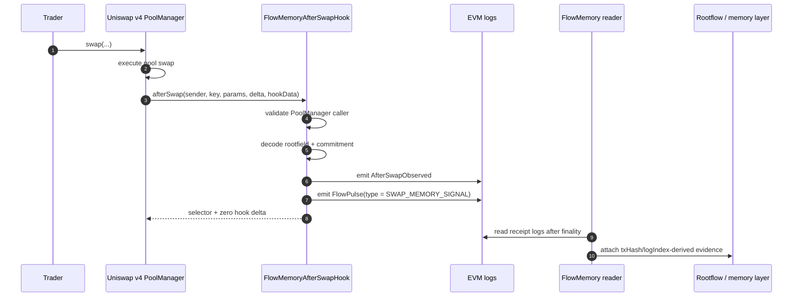
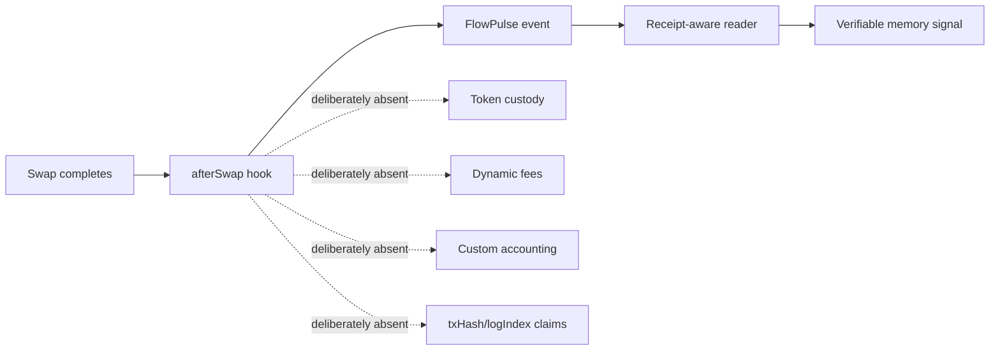

# FlowMemory Uniswap V4 Hooks

[](https://github.com/FlowmemoryAI/flowmemory-uniswap-v4-hooks/actions/workflows/ci.yml)

Public reference implementation for the first FlowMemory hook surface: a Uniswap v4 `afterSwap` hook that turns swap execution into verifiable FlowMemory signals.

This repository is intentionally narrow. It is not the full FlowMemory monorepo, and it is not a token, custody system, fee engine, or production launch claim. It is the public, runnable artifact that explains and tests the hook path that FlowMemory expects to bring live first.

## The Short Version

FlowMemory uses a Uniswap v4 `afterSwap` hook as a clean observation point. When a swap completes, the hook emits a `FlowPulse` memory signal that can be read, indexed, verified, and connected to later FlowMemory/Rootflow state.



The hook does four things deliberately:

- it only runs after a swap;
- it emits public memory evidence;
- it returns zero hook delta;
- it leaves transaction receipt metadata to off-chain readers, where that metadata actually exists.

## Why This Works

Uniswap v4 hooks let a pool call external logic at specific lifecycle points, including `afterSwap`. FlowMemory uses that extension point as an evidence boundary, not as a custody or fee mechanism.

That makes the design small enough to reason about:

- `PoolManager` is the only authorized caller;
- `afterSwap` is the only intended hook permission;
- `FlowPulse` is the canonical public signal;
- `txHash`, `transactionIndex`, and `logIndex` are derived after execution by the reader;
- the hook never takes funds and never changes swap accounting.

For the full engineering argument, see [docs/WHY_IT_WORKS.md](docs/WHY_IT_WORKS.md).

## Why This Is Different

Many hook designs try to do too much inside the hook: fee logic, custody, accounting, routing, or assumptions about receipt metadata. FlowMemory keeps the on-chain hook intentionally boring and moves interpretation to a verifier/reader layer.

That is the point. The first public hook should be easy to inspect, easy to test, and hard to misunderstand.



## Repository Map

```text
contracts/
  FlowMemoryAfterSwapHook.sol      # PoolManager-gated afterSwap hook candidate
  FlowMemoryHookPlanner.sol        # Hook flag helpers and Base Sepolia CREATE2 planner
  FlowPulse.sol                    # FlowPulse event schema and pulse type ids
  interfaces/
    IFlowMemoryHookAdapter.sol     # Encoded hook-data shape
    IUniswapV4SwapHookLike.sol     # Minimal ABI-compatible v4 afterSwap surface
test/
  FlowMemoryAfterSwapHook.t.sol    # Dependency-light Foundry tests
docs/
  ARCHITECTURE.md                  # System and trust-boundary diagrams
  WHY_IT_WORKS.md                  # Design rationale and tradeoffs
  EVENT_MODEL.md                   # FlowPulse and reader-derived metadata
  SECURITY_MODEL.md                # Threat model, invariants, non-goals
  PUBLIC_RELEASE_PATH.md           # Base Sepolia and public launch evidence path
  BASE_SEPOLIA_PLAN.md             # Concrete Base Sepolia planning facts
  HOW_IT_WORKS.md                  # Direct code-level walkthrough
```

## Run It

Install [Foundry](https://book.getfoundry.sh/), then:

```bash
forge test -vvv
```

Targeted checks:

```bash
forge test --match-test testAfterSwapHookEmitsFlowPulseAndReturnsZeroHookDelta -vvv
forge test --match-test testPlannerMinesBaseSepoliaCreate2AddressWithTargetFlags -vvv
forge test --match-test testAfterSwapHookIsPoolManagerGated -vvv
```

Expected local result:

```text
Ran 7 tests for test/FlowMemoryAfterSwapHook.t.sol:FlowMemoryAfterSwapHookTest
Suite result: ok. 7 passed; 0 failed; 0 skipped
```

## Contract Invariants

The tests enforce the properties that matter for the first public hook:

| Property | Why it matters |
| --- | --- |
| PoolManager-gated callback | Prevents arbitrary callers from fabricating swap memory signals through the hook callback. |
| `afterSwap` only | Keeps the Uniswap v4 permission surface small and auditable. |
| Zero hook delta | Avoids custom accounting and token balance side effects. |
| No custody path | The hook observes and emits evidence; it does not hold user assets. |
| No dynamic-fee path | The hook is not a fee controller. |
| Receipt metadata excluded | `txHash` and `logIndex` are reader-derived after the transaction is mined. |
| CREATE2 planning | The hook address can be mined to match the v4 hook permission bits. |

## Public Release Boundary

The current repository is the public reference and live-prep package. A real live release requires a separate release record with:

- chain id;
- PoolManager address;
- deployer address;
- constructor args;
- init code hash;
- mined salt;
- computed hook address;
- deployment transaction hash;
- source verification URL;
- reader block range;
- observed `AfterSwapObserved` logs;
- observed `FlowPulse` logs;
- explicit statement that receipt metadata is reader-derived.

See [docs/PUBLIC_RELEASE_PATH.md](docs/PUBLIC_RELEASE_PATH.md).

## External References

- [Uniswap v4 hooks concept documentation](https://developers.uniswap.org/contracts/v4/concepts/hooks)
- [Uniswap v4 swap hooks quickstart](https://developers.uniswap.org/contracts/v4/quickstart/hooks/swap)
- [Uniswap v4 hook deployment documentation](https://developers.uniswap.org/docs/protocols/v4/guides/hooks/hook-deployment)
- [Uniswap v4 PoolManager interface documentation](https://developers.uniswap.org/contracts/v4/reference/core/interfaces/IPoolManager)

## Status

This repo is public, runnable, and CI-tested. It is the hook reference path FlowMemory can share first.

It is not a production Base mainnet deployment claim.
