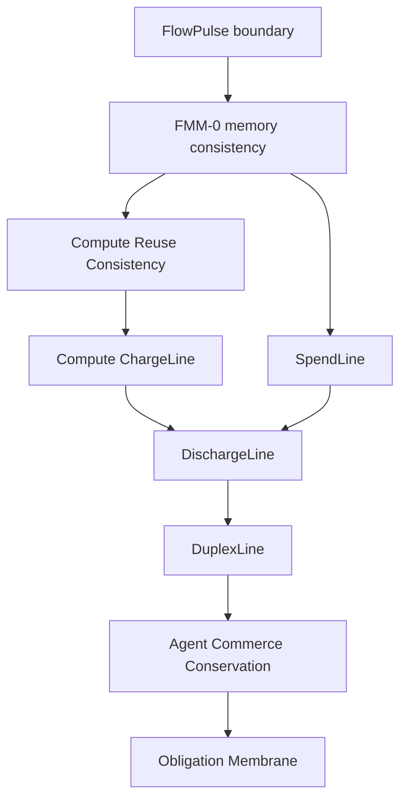

# Memory-Native Agent Commerce Stack

AI agents on Base will not only sign transactions.

They will pay APIs, buy compute, hire subagents, delegate work, retry failed
branches, reuse cached artifacts, settle payments, and claim that obligations
are complete.

The payment rail can show that value moved.

FlowMemory asks a harder question:

```text
Could this economic state have emerged from the agent's receipt-bound memory?
```

That is the category:

```text
memory-native agent commerce
```

## Core Claim

```text
Payments move value. FlowMemory checks whether the obligation history is legal.
```

The stack is intentionally local and deterministic in this repo. It does not
claim custody, escrow, wallet authorization, fund protection, work-quality
proof, semantic truth, model correctness, GPU acceleration, production verifier
infrastructure, or live Base mainnet deployment.

## The Stack



## Layer By Layer

### FlowPulse Boundary

The transaction is the proof envelope.

The FlowPulse is the memory artifact.

The hook does not know `txHash` or `logIndex` during execution. Reader/verifier
infrastructure attaches receipt facts later.

### FMM-0

FMM-0 checks whether a machine history could have happened around receipt-bound
FlowPulse boundaries.

It is not semantic truth. It is memory consistency.

### Compute Reuse Consistency

Compute reuse is allowed only when cache lineage, compute fingerprint, and
receipt-bound history agree.

This keeps GPU workflow reuse from becoming a stale-output shortcut.

### Compute ChargeLine

Compute ChargeLine checks whether a compute payment matches the
memory-consistent compute route.

It accepts fresh compute charged as fresh and safe reuse charged as reuse.

It rejects unsafe reuse, fresh-compute policy laundering, duplicate charges,
runtime drift, payment requirement drift, stale buyer memory heads, and missing
required attestation references.

Core line:

```text
Compute billing without memory consistency is invoice optimism.
```

### SpendLine

SpendLine checks whether an autonomous spend can join a receipt-bound memory
history.

It does not authorize the wallet. It asks whether the spend is
memory-linearizable.

### DischargeLine

DischargeLine checks whether a receipt closes the right obligation.

Settlement is not discharge.

A transaction can settle while the obligation remains open.

Core line:

```text
Wallets show that money moved. DischargeLine asks whether the right obligation actually closed.
```

### DuplexLine

DuplexLine checks whether buyer spend and seller work can be co-serialized into
one legal exchange history.

It does not prove work quality or settle disputes. It checks whether both sides
of the exchange can exist in the same receipt-bound machine history.

### Agent Commerce Conservation

Agent Commerce Conservation checks whether the whole episode balances.

It asks whether declared obligations conserve across spend, work, compute,
refusal, and memory state.

Core line:

```text
Autonomous commerce does not only need payments that settle. It needs obligations that conserve.
```

### Obligation Membrane

Obligation Membrane checks whether an obligation can survive delegation through
subagents, brokers, compute providers, and aggregate work without laundering
away its constraints.

Core line:

```text
Autonomous commerce does not only need payments that settle. It needs obligations that cannot be laundered.
```

## What This Catches

- a reuse route charged as fresh compute;
- unsafe compute reuse paid as if it were valid;
- a settled payment that does not discharge the right obligation;
- wrong-recipient discharge;
- stale quote discharge;
- duplicate obligation discharge;
- buyer/seller exchange histories that cannot be co-serialized;
- a balanced-looking episode with orphan work or orphan payment;
- a delegated obligation that downgrades FMM-0 requirements;
- a child refusal swallowed by a parent agent;
- a compute provider changing rootfield, runtime, or payee assumptions under a parent obligation.

## What This Is Not

- Not custody.
- Not escrow.
- Not wallet authorization.
- Not fund protection.
- Not work-quality proof.
- Not semantic truth.
- Not model correctness.
- Not GPU acceleration.
- Not production verifier infrastructure.
- Not a live Base mainnet deployment claim.

## Public Framing

Use:

```text
Autonomous commerce does not only need payments. It needs memory-consistent obligations.
```

Use:

```text
Settlement is not discharge.
```

Use:

```text
Payments move value. FlowMemory checks whether the obligation history is legal.
```

Avoid:

```text
FlowMemory protects funds.
FlowMemory proves the work is correct.
FlowMemory provides escrow.
FlowMemory authorizes wallet transactions.
FlowMemory is live on Base mainnet.
```
