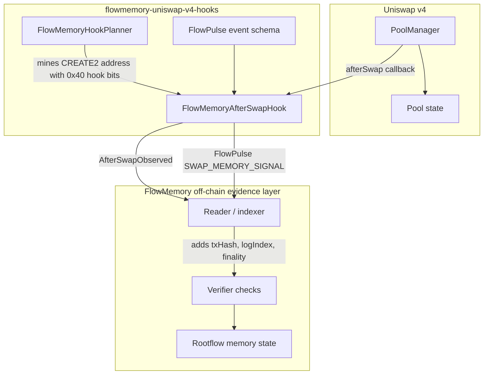
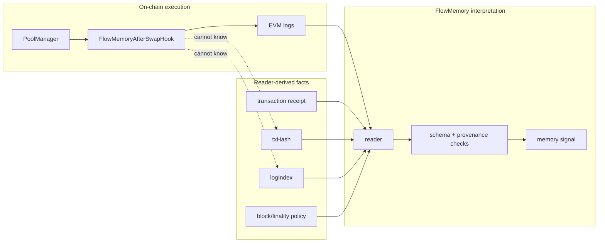
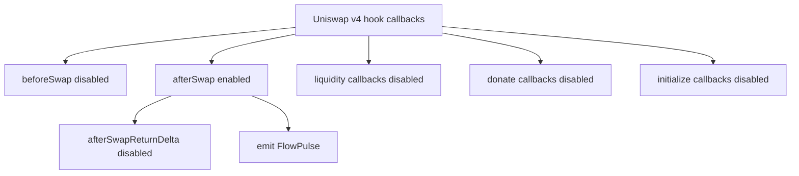

# Architecture

FlowMemory's first public hook path is designed around a small contract surface and a clear evidence boundary.

The hook does not try to be a full protocol inside a swap callback. It records a memory signal at the moment Uniswap v4 gives the hook a valid post-swap execution point, then lets readers and verifiers attach receipt-aware facts after the transaction exists.

## System Context

## Execution Flow

## Trust Boundaries

The hook only emits what the EVM can know inside execution. Receipt fields are outside that boundary.

## Component Responsibilities

| Component | Responsibility | What it must not do |
| --- | --- | --- |
| `FlowMemoryAfterSwapHook` | Validate callback caller, decode memory payload, emit `AfterSwapObserved` and `FlowPulse`. | Custody tokens, override fees, fabricate receipt metadata, perform custom accounting. |
| `FlowMemoryHookPlanner` | Compute hook permission bits and CREATE2 candidate addresses for Base Sepolia planning. | Deploy contracts, hold keys, print secrets. |
| `FlowPulse` | Define the public event schema and stable pulse type ids. | Describe off-chain receipt facts as on-chain facts. |
| Reader / indexer | Read logs, attach receipt fields, enforce finality windows. | Rewrite event payloads or treat unfinalized logs as final. |
| Verifier | Check event schema, provenance, expected contract, topic signatures, and finality. | Trust arbitrary UI claims without logs. |

## Why The Hook Surface Is Small

The public release needs a low-ambiguity contract. Each additional hook permission increases the number of execution paths that reviewers, pool creators, and users must understand.

FlowMemory starts with exactly one callback:

That choice keeps the first public hook focused on evidence, not hidden control.
