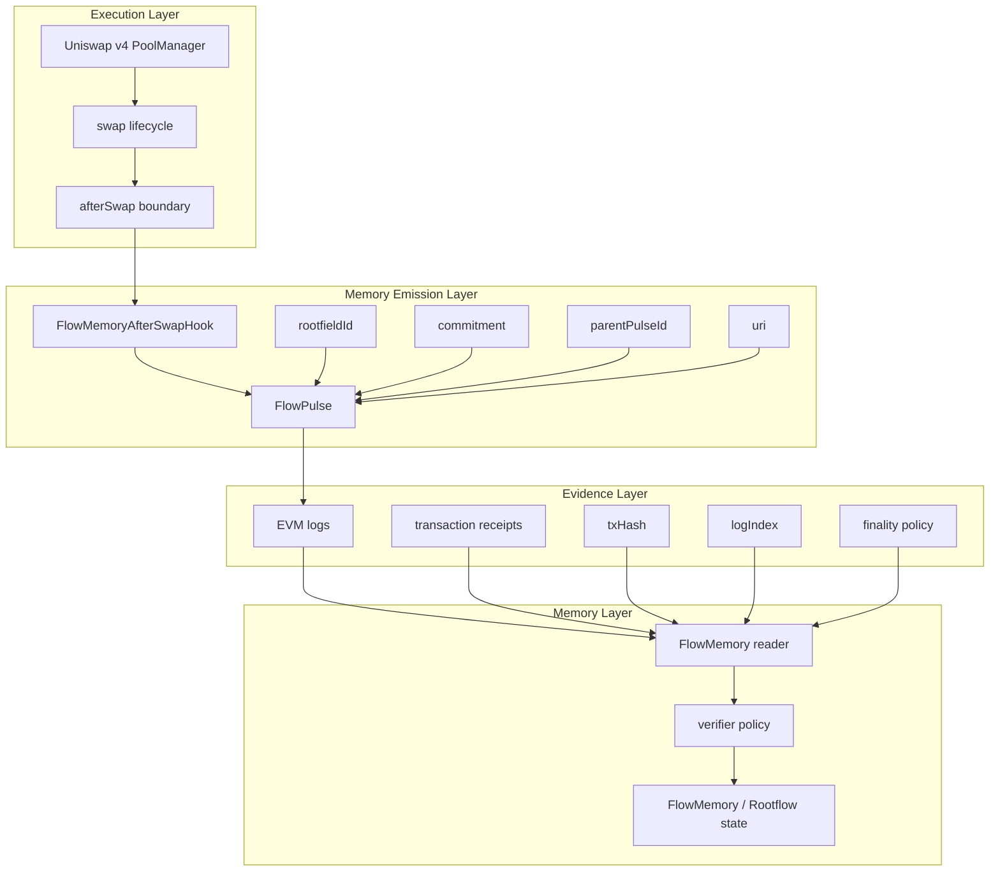
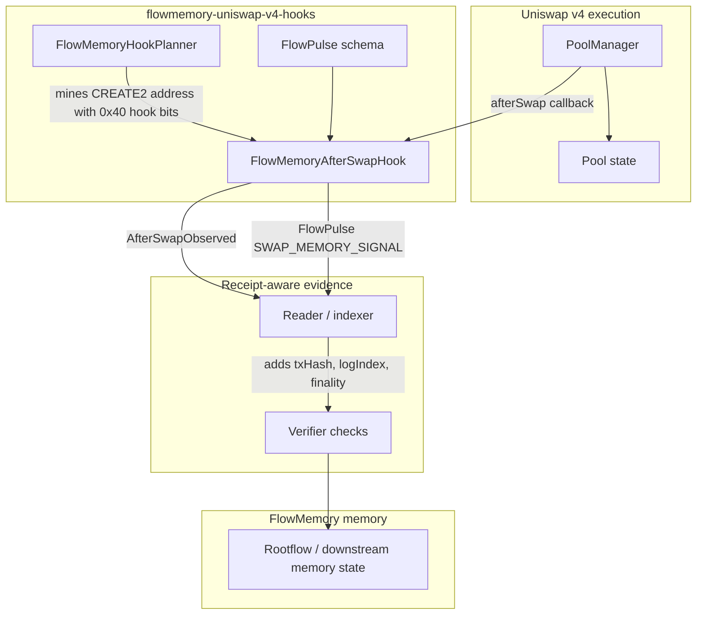
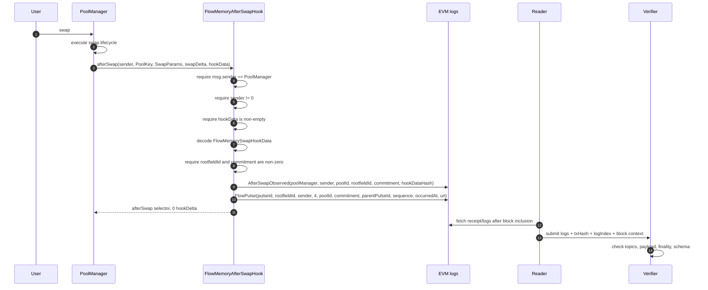
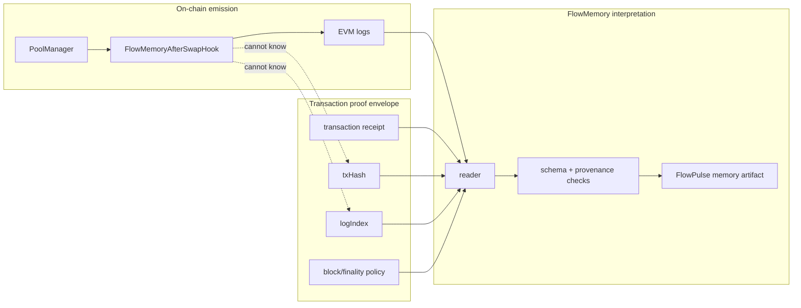
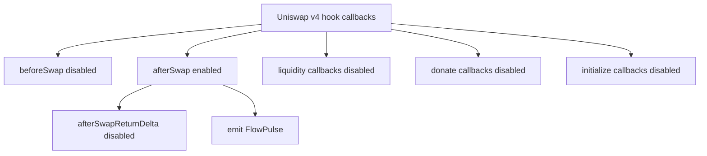

# Architecture

FlowMemory separates execution, emission, evidence, and memory.

That separation is the architecture. The Uniswap v4 swap is execution. The `afterSwap` hook is the verified on-chain emission boundary. The EVM receipt is the proof envelope. The `FlowPulse` is the memory artifact.

This repository is not trying to put a full protocol inside a swap callback. It defines the first public memory-native hook primitive: a narrow, PoolManager-gated surface where DeFi execution can emit a protocol-level memory signal.

## Layer Model

## System Context

## Execution Flow

The hook emits the memory signal. The reader proves where it landed.

## Component Responsibilities

| Component | Responsibility | What it must not do |
| --- | --- | --- |
| `FlowMemoryAfterSwapHook` | Validate callback caller, decode memory payload, emit `AfterSwapObserved` and `FlowPulse`. | Custody tokens, override fees, route swaps, fabricate receipt metadata, perform custom accounting. |
| `FlowMemoryHookPlanner` | Compute hook permission bits and CREATE2 candidate addresses for Base Sepolia planning. | Deploy contracts, hold keys, print secrets. |
| `FlowPulse` | Define the public memory signal schema and stable pulse type ids. | Describe off-chain receipt facts as on-chain facts. |
| Reader / indexer | Read logs, attach receipt fields, enforce finality windows. | Rewrite event payloads or treat unfinalized logs as final. |
| Verifier | Check event schema, provenance, expected contract, topic signatures, and finality. | Trust arbitrary UI claims without logs. |
| FlowMemory / Rootflow | Consume verified pulse records as memory artifacts. | Treat ordinary swaps as FlowMemory without an emitted pulse. |

## Trust Boundaries

The hook only emits what the EVM can know inside execution. Receipt fields are outside that boundary.

## Why The Hook Surface Is Small

The hook is deliberately minimal because the primitive is not execution control. The primitive is verifiable memory emission.

Most hooks change what a swap does. FlowMemory changes what a swap can prove.
