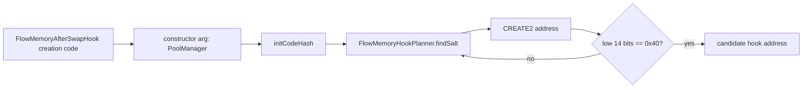

# Base Sepolia Plan

The first deployment target for the FlowMemory hook surface should be Base Sepolia before any Base mainnet claim.

This file records the concrete deployment planning facts that are safe to publish now. It does not contain private keys, RPC credentials, or signed transactions.

## Target

| Field | Value |
| --- | --- |
| Chain | Base Sepolia |
| Chain id | `84532` |
| Uniswap v4 PoolManager | `0x05E73354cFDd6745C338b50BcFDfA3Aa6fA03408` |
| CREATE2 deployer | `0x4e59b44847b379578588920cA78FbF26c0B4956C` |
| Hook permission bits | `0x40` |
| Enabled callback | `afterSwap` |
| Return delta callbacks | disabled |

The PoolManager address is taken from the official Uniswap v4 deployments page. The planner constants are in `contracts/FlowMemoryHookPlanner.sol`.

## Planning Diagram



Uniswap v4 hook permissions are encoded in the hook address. For this first memory-native hook primitive, the address must resolve to the `afterSwap` permission and avoid extra return-delta/custom-accounting flags.

## Local Verification

Run:

```bash
forge test --match-test testPlannerMinesBaseSepoliaCreate2AddressWithTargetFlags -vvv
forge test --match-test testAfterSwapHookEmitsFlowPulseAndReturnsZeroHookDelta -vvv
```

The first test confirms the CREATE2 planner can find an address with only the `afterSwap` hook flag. The second confirms the callback emits the FlowPulse memory artifact and returns zero hook delta.

## Required Live Release Record

Before announcing any live hook, publish a release record with:

- chain id;
- PoolManager address;
- deployer address;
- constructor args;
- init code hash;
- mined salt;
- computed hook address;
- deployment transaction hash;
- source verification URL;
- reader block range;
- observed `AfterSwapObserved` logs;
- observed `FlowPulse` logs;
- explicit statement that receipt metadata is reader-derived.

## Release Record Template

```text
FlowMemory Uniswap v4 hook release record

Network:
Chain id:
PoolManager:
Create2 deployer:
Hook contract:
Constructor args:
Init code hash:
Salt:
Computed hook address:
Hook permission bits:
Deployment transaction:
Deployment block:
Source verification:

Reader evidence
From block:
To block:
Finalized block:
AfterSwapObserved log count:
FlowPulse log count:
Sample tx hash:
Sample FlowPulse log index:

Boundary
Receipt metadata is reader-derived:
No custody path:
No dynamic fee path:
Zero hook delta:
```

## Non-Goals

This repo does not implement:

- token custody;
- fee overrides;
- dynamic fees;
- custom accounting;
- production governance;
- production multisig policy;
- a production Base mainnet deployment claim.
