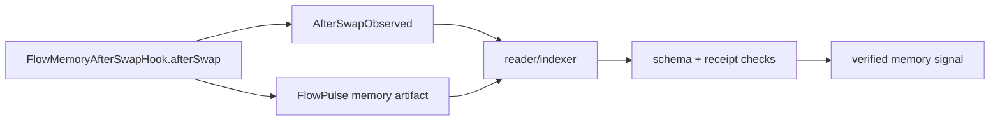
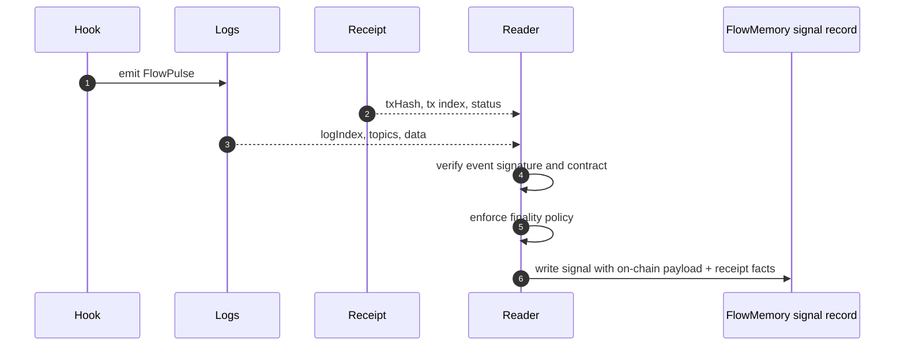

# Event Model

FlowPulse is the memory artifact.

The transaction is the proof envelope.

The hook emits the memory signal. The reader proves where it landed.

FlowMemory's hook path uses two events:

- `AfterSwapObserved`, a hook-local audit event;
- `FlowPulse`, the canonical FlowMemory memory signal.

The split keeps hook inspection and FlowMemory indexing separate without forcing the hook to store extra state or pretend it knows receipt metadata during execution.

## Event Flow



## `AfterSwapObserved`

```solidity
event AfterSwapObserved(
    address indexed caller,
    address indexed sender,
    bytes32 indexed poolId,
    bytes32 rootfieldId,
    bytes32 commitment,
    bytes32 hookDataHash
);
```

Purpose:

- confirms which PoolManager triggered the hook;
- records the swap sender passed into the callback;
- records the derived pool id;
- records the FlowMemory rootfield;
- records the memory commitment;
- records the hash of the hook context used for pulse derivation.

This event is useful for hook-specific inspection and debugging. It is not the full memory artifact. `FlowPulse` is the artifact FlowMemory systems consume.

`hookDataHash` is the hash of the hook context used for signal derivation. In the current contract it hashes:

```text
abi.encode(params.zeroForOne, params.amountSpecified, params.sqrtPriceLimitX96, swapDelta, hookData)
```

It is not just `keccak256(rawHookData)`.

## `FlowPulse`

```solidity
event FlowPulse(
    bytes32 indexed pulseId,
    bytes32 indexed rootfieldId,
    address indexed actor,
    uint8 pulseType,
    bytes32 subject,
    bytes32 commitment,
    bytes32 parentPulseId,
    uint64 sequence,
    uint64 occurredAt,
    string uri
);
```

For the Uniswap v4 hook:

| Field | Meaning |
| --- | --- |
| `pulseId` | Domain-separated id derived from schema, chain, hook, PoolManager, sender, pool id, rootfield, commitment, parent pulse, hook context hash, and sequence. |
| `rootfieldId` | FlowMemory namespace receiving the signal. |
| `actor` | Swap sender passed to the hook by PoolManager. This may be a router or contract, not necessarily the trader EOA. |
| `pulseType` | `4`, meaning `SWAP_MEMORY_SIGNAL`. |
| `subject` | Derived Uniswap v4 pool id. |
| `commitment` | Opaque commitment to an off-chain or downstream memory artifact. The hook checks non-zero, not semantic truth. |
| `parentPulseId` | Optional prior pulse reference. The hook does not verify parent existence. |
| `sequence` | Monotonic per-rootfield hook sequence, not per pool and not per actor. |
| `occurredAt` | Block timestamp as `uint64`. |
| `uri` | Untrusted advisory URI, defaulting to `flowmemory://uniswap-v4/after-swap` when blank. Readers should treat it as metadata, not authority. |

The commitment is intentionally opaque. The hook proves that a commitment was emitted at the boundary. Reader/verifier and downstream FlowMemory policy decide whether the commitment's semantics are accepted.

## Reader-Derived Receipt Fields

`txHash`, `transactionIndex`, and `logIndex` are not known by the hook during execution.

The reader attaches facts that the hook cannot know:

| Reader-derived field | Source |
| --- | --- |
| `txHash` | Transaction receipt. |
| `transactionIndex` | Transaction receipt. |
| `logIndex` | Log receipt position. |
| `blockHash` | Block containing the receipt. |
| `receiptStatus` | Transaction receipt. |
| finality depth | Reader policy and chain head. |



## Minimal Reader Algorithm

```text
for each finalized block in range:
  fetch logs for FlowMemoryAfterSwapHook
  for each log:
    require topic0 is FlowPulse or AfterSwapObserved
    require emitting contract is expected hook address
    fetch containing transaction receipt
    attach txHash, transactionIndex, logIndex, blockHash, receiptStatus
    decode FlowPulse data
    require pulseType == SWAP_MEMORY_SIGNAL
    require rootfieldId != 0
    require commitment != 0
    write append-only signal record
```

## Schema Invariants

The tests assert that event schemas do not accidentally drift into receipt metadata:

- `FlowPulse` must not include `txHash`;
- `FlowPulse` must not include `logIndex`;
- `AfterSwapObserved` must not include receipt-only fields;
- the hook must emit both events for a valid `afterSwap`.

That is why `testHookEventSchemasExcludeTxHashAndLogIndexAssumptions` exists.
