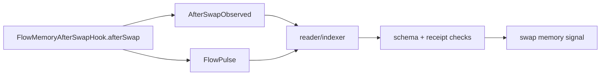
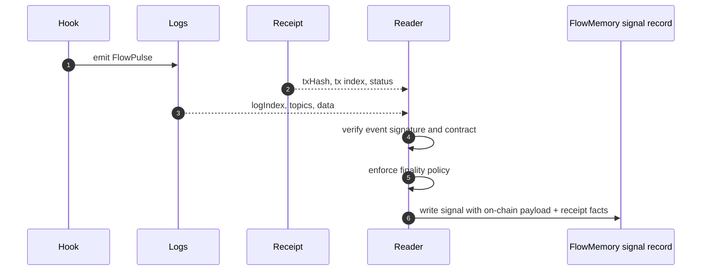

# Event Model

FlowMemory's hook path uses two events:

- `AfterSwapObserved`, a hook-local audit event;
- `FlowPulse`, the canonical FlowMemory memory signal.

The split keeps hook debugging and FlowMemory indexing separate without forcing the hook to store extra state.

## Event Flow



## `AfterSwapObserved`

```solidity
event AfterSwapObserved(
    address indexed caller,
    address indexed sender,
    bytes32 indexed poolId,
    bytes32 rootfieldId,
    bytes32 commitment,
    bytes32 hookDataHash
);
```

Purpose:

- confirms which `PoolManager` triggered the hook;
- records the swap sender;
- records the derived pool id;
- records the FlowMemory rootfield;
- records the memory commitment;
- records the hash of the hook context.

This event is useful for hook-specific inspection and debugging.

## `FlowPulse`

```solidity
event FlowPulse(
    bytes32 indexed pulseId,
    bytes32 indexed rootfieldId,
    address indexed actor,
    uint8 pulseType,
    bytes32 subject,
    bytes32 commitment,
    bytes32 parentPulseId,
    uint64 sequence,
    uint64 occurredAt,
    string uri
);
```

For the Uniswap v4 hook:

| Field | Meaning |
| --- | --- |
| `pulseId` | Domain-separated id derived from schema, chain, hook, PoolManager, sender, pool id, rootfield, commitment, parent pulse, hook data hash, and sequence. |
| `rootfieldId` | FlowMemory namespace receiving the signal. |
| `actor` | Swap sender passed to the hook. |
| `pulseType` | `4`, meaning `SWAP_MEMORY_SIGNAL`. |
| `subject` | Derived Uniswap v4 pool id. |
| `commitment` | Commitment to off-chain or downstream memory artifact. |
| `parentPulseId` | Optional prior pulse reference. |
| `sequence` | Monotonic per-rootfield hook sequence. |
| `occurredAt` | Block timestamp as `uint64`. |
| `uri` | Advisory URI, defaulting to `flowmemory://uniswap-v4/after-swap` when blank. |

## Reader-Derived Receipt Fields

The reader attaches facts that the hook cannot know during execution:

| Reader-derived field | Source |
| --- | --- |
| `txHash` | Transaction receipt. |
| `transactionIndex` | Transaction receipt. |
| `logIndex` | Log receipt position. |
| `blockHash` | Block containing the receipt. |
| `receiptStatus` | Transaction receipt. |
| finality depth | Reader policy and chain head. |



## Minimal Reader Algorithm

```text
for each finalized block in range:
  fetch logs for FlowMemoryAfterSwapHook
  for each log:
    require topic0 is FlowPulse or AfterSwapObserved
    require emitting contract is expected hook address
    fetch containing transaction receipt
    attach txHash, transactionIndex, logIndex, blockHash, receiptStatus
    decode FlowPulse data
    require pulseType == SWAP_MEMORY_SIGNAL
    require rootfieldId != 0
    require commitment != 0
    write append-only signal record
```

## Schema Invariants

The tests assert that event schemas do not accidentally drift into receipt metadata:

- `FlowPulse` must not include `txHash`;
- `FlowPulse` must not include `logIndex`;
- `AfterSwapObserved` must not include receipt-only fields;
- the hook must emit both events for a valid `afterSwap`.

That is why `testHookEventSchemasExcludeTxHashAndLogIndexAssumptions` exists.
