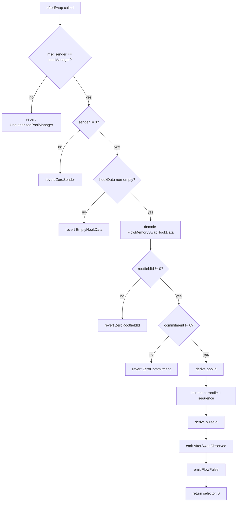
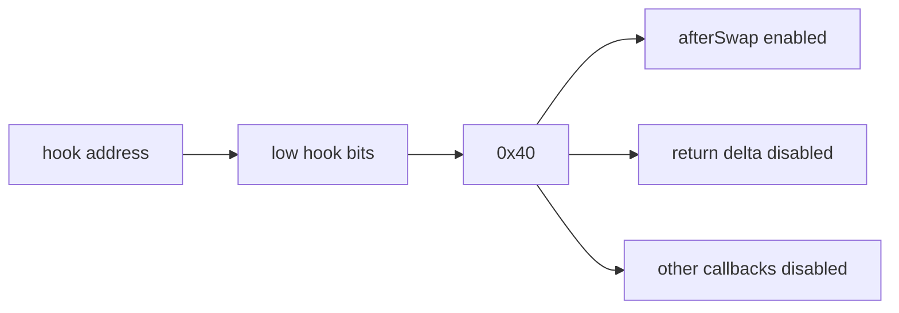

# How The Hook Works

This is the code-level walkthrough for the first public FlowMemory Uniswap v4 hook path.

## Contract Path

The hook path is centered on `FlowMemoryAfterSwapHook.afterSwap`:

```text
PoolManager.afterSwap callback
  -> FlowMemoryAfterSwapHook.afterSwap(...)
  -> decode FlowMemorySwapHookData
  -> derive poolId from PoolKey
  -> emit AfterSwapObserved
  -> emit FlowPulse(..., pulseType = 4, ...)
  -> return selector and zero hook delta
```

The hook accepts the ABI-compatible fields FlowMemory needs from the Uniswap v4 swap callback:

- `sender`;
- `PoolKey`;
- `SwapParams`;
- `swapDelta`;
- `hookData`.

`hookData` is ABI-encoded as:

```solidity
struct FlowMemorySwapHookData {
    bytes32 rootfieldId;
    bytes32 commitment;
    bytes32 parentPulseId;
    string uri;
}
```

## Step-By-Step



## Event Boundary

The public memory signal is `FlowPulse`:

```solidity
event FlowPulse(
    bytes32 indexed pulseId,
    bytes32 indexed rootfieldId,
    address indexed actor,
    uint8 pulseType,
    bytes32 subject,
    bytes32 commitment,
    bytes32 parentPulseId,
    uint64 sequence,
    uint64 occurredAt,
    string uri
);
```

For swaps, `pulseType` is `4` (`SWAP_MEMORY_SIGNAL`) and `subject` is the derived pool id.

The event intentionally does not include `txHash`, `transactionIndex`, or `logIndex`. Those are receipt fields and are only available to off-chain readers after the transaction is mined.

## Permission Model

`FlowMemoryHookPlanner` defines the permission target:

- `afterSwap`: enabled;
- `afterSwapReturnDelta`: disabled;
- `beforeSwap`: disabled;
- liquidity, donate, initialize hooks: disabled.

The expected low hook bits are `0x40`, matching the Uniswap v4 `AFTER_SWAP_FLAG`.



## Safety Properties Tested

The Foundry tests verify:

- the permission planner targets only `afterSwap`;
- the planner rejects extra custom-accounting bits;
- a Base Sepolia CREATE2 salt can be mined for the target hook flags;
- `afterSwap` emits both `AfterSwapObserved` and `FlowPulse`;
- the hook returns zero hook delta;
- only the configured `PoolManager` can call `afterSwap`;
- empty hook data, zero rootfield id, and zero commitment revert;
- event schemas exclude receipt-only metadata assumptions.
