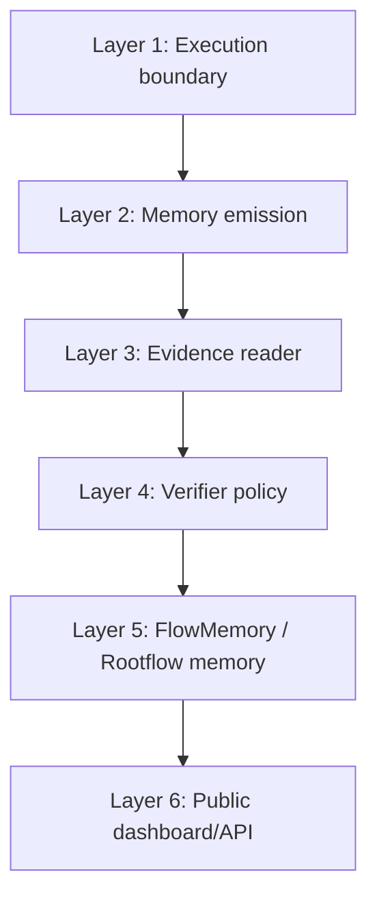
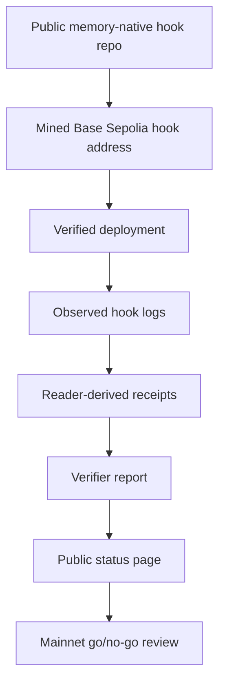

# Integration Blueprint

This document describes how the hook repo fits into the larger FlowMemory public launch without requiring the full private system to be public on day one.

The integration thesis is simple:

Execution already exists. Memory is the missing layer.

## Layers



| Layer | Public artifact | Launch expectation |
| --- | --- | --- |
| Execution boundary | Uniswap v4 `afterSwap` callback | Must be understood as lifecycle boundary, not finality. |
| Memory emission | This repo | Public, tested, source-verifiable. |
| Evidence reader | Release evidence, later code package | Must show receipt-derived records before live claims. |
| Verifier policy | Public checklist/report | Must explain accepted/rejected evidence. |
| FlowMemory / Rootflow memory | Public summary or dashboard | Must not overstate finality or verifier scope. |
| Public dashboard/API | FlowMemory public surface | Must show status, contract, logs, and boundaries. |

## Data Flow

```mermaid
flowchart LR
    Swap["Uniswap v4 swap"] --> Boundary["afterSwap boundary"]
    Boundary --> Hook["FlowMemoryAfterSwapHook"]
    Hook --> Pulse["FlowPulse memory artifact"]
    Pulse --> Reader["reader/indexer"]
    Reader --> Evidence["normalized proof-envelope record"]
    Evidence --> Verifier["verifier checks"]
    Verifier --> Rootflow["FlowMemory / Rootflow state update"]
    Rootflow --> Public["public page/API"]
```



## Integration Contracts

The hook repo exposes a small contract interface:

- `afterSwap(...) returns (bytes4 selector, int128 hookDelta)`;
- `encodeSwapHookData(...) returns (bytes memory)`;
- `hasPermissionedHookAddress() returns (bool)`;
- `AfterSwapObserved`;
- `FlowPulse`.

The downstream system should treat those as the stable boundary. Anything more complex belongs outside the hook.

## Public API Shape

A later public API can expose:

```text
GET /hooks/uniswap-v4/status
GET /hooks/uniswap-v4/releases/latest
GET /hooks/uniswap-v4/signals?chainId=84532
GET /hooks/uniswap-v4/signals/:txHash/:logIndex
```

The API should never require browser users to submit private keys, seed phrases, RPC credentials, API keys, or wallet vault material.

## Release Dependencies



## What Can Be Shared First

Share this repo first when you want to show:

- the first public FlowMemory hook primitive;
- why `afterSwap` is the chosen lifecycle point;
- the event model;
- what safety boundaries are intentionally absent;
- how reviewers can run the tests;
- what evidence will be required next.

Do not use this repo alone to claim:

- Base Sepolia deployment;
- Base mainnet deployment;
- production readiness;
- audited custody;
- completed verifier network.

## Suggested Public Narrative

FlowMemory introduces the first memory-native Uniswap v4 hook primitive: a verified on-chain emission boundary where DeFi execution can produce FlowPulse memory signals.

Most hooks change what a swap does. FlowMemory changes what a swap can prove.

The hook keeps the on-chain surface narrow: PoolManager-gated, afterSwap-only, zero hook delta, no custody, no dynamic fee path, no routing path. Receipt facts are derived by readers after the transaction lands. That separation gives the public a clean primitive to inspect now and a concrete evidence path for Base Sepolia next.
