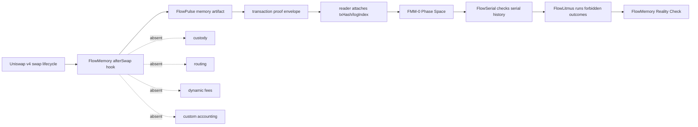

# FlowMemory Reality Check

FlowMemory Reality Check is the launch-grade command for this repository.

It gives a reviewer one terminal screenshot that connects the hook, the
FlowPulse boundary model, receipt metadata separation, FlowSerial, and
FlowLitmus.

It now also names the runtime model and its state surface:

- **FMM-0: FlowMemory Agent Memory Model**;
- **FMM-0 Phase Space**.

## Command

```bash
python tools/launch_reality_check.py --pretty
```

Optional screenshot artifact:

```bash
python tools/launch_reality_check.py --pretty \
  --write examples/launch-reality-check/latest-output.txt
```

For the claim-to-evidence launch scorecard, run:

```bash
python tools/memory_consistency_card.py --pretty
```

For the 10-minute skeptic review packet, run:

```bash
python tools/reviewer_walkthrough.py --pretty
```

For the pending-safe public receipt evidence gate, run:

```bash
python tools/verify_release_evidence.py --pretty
```

For the forbidden-outcomes casebook, run:

```bash
python tools/render_flowlitmus_casebook.py --check
```

For the phase-space demo, run:

```bash
python tools/fmm0_phase_table.py demo --pretty
```

## What This Demo Proves

It proves the repo can execute local runtime consistency checks around
receipt-bound FlowPulse boundaries.

It checks:

- the boundary model;
- the narrow hook invariant surface;
- required launch artifacts;
- FMM-0 Phase Space;
- the FlowLitmus forbidden-outcome suite.

Expected result:

```text
Result: FlowMemory can tell impossible histories from live ones using receipt-bound FlowPulse boundaries.
```

## Runtime Path



## What This Demo Does Not Prove

No live mainnet deployment.

No audited production infrastructure.

No custody.

No fund protection.

No swap control.

No semantic truth.

No model correctness.

No GPU acceleration.

No production verifier infrastructure.

## What To Screenshot

Screenshot the terminal output from:

```bash
python tools/launch_reality_check.py --pretty
```

The strongest part is the FlowLitmus table:

```text
FM-LB-001   pre-receipt txHash read                PASS  forbidden_pre_receipt_read
FM-SER-001  retrocausal receipt claim              PASS  retrocausal_receipt_claim
FM-QS-001   unquiesced post-boundary output        PASS  QuiescenceViolation
FM-RT-001   speculative output escaped             PASS  RetirementViolation
FM-FIS-001  stale output survived boundary         PASS  BoundaryFissionViolation
FM-SER-002  rootfield rollback                     PASS  rootfield_rollback
FM-SER-003  split-brain canonical write            PASS  split_brain_write
FM-OK-001   valid boundary history                 PASS  Serializable
```

## What To Say Publicly

Use these three lines first:

```text
The swap is not the memory.
The transaction is the proof envelope.
The FlowPulse is the memory artifact.
```

Then add:

```text
FlowLitmus shows why this matters: agents can now fault impossible histories around receipt-bound execution boundaries.
```

For the AI-memory angle, use:

```text
Everyone treated agent memory like retrieval. FlowMemory treats it like a memory model.
```

For the phase-table angle, use:

```text
Retrieval treats memory as text; FMM-0 treats machine history as a phase space with forbidden transitions.
```

## 30-Second Founder Script

FlowMemory starts with a Uniswap v4 `afterSwap` hook that emits a FlowPulse.
The swap is not the memory. The transaction is the proof envelope. The
FlowPulse is the memory artifact.

But the deeper launch claim is runtime consistency. Agents are becoming
distributed systems: model calls, tool calls, state writes, caches, and compute
jobs all crossing external events. FlowLitmus is our executable
forbidden-outcome suite. It tests whether an agent history respects FlowPulse
receipt boundaries or becomes impossible.

FMM-0 Phase Space makes the boundary visible before the litmus suite runs. A
local output, a reader-derived FlowPulse, and an
FMM-0-conforming history are different phases of machine state. A pre-receipt
artifact cannot claim `txHash` or `logIndex`, and a local artifact cannot jump
straight into live FMM-0 state.

So the launch is not "we emitted an event." The launch is: FlowMemory gives
machines a way to tell live histories from impossible ones.

## Claims To Avoid

Do not say:

- live mainnet deployment;
- audited production infrastructure;
- custody;
- fund protection;
- swap control;
- custom accounting;
- semantic truth;
- model correctness;
- GPU acceleration;
- production compute verifier;
- `txHash` or `logIndex` known inside the hook.

Say instead:

- local R&D runtime conformance;
- receipt-bound FlowPulse artifacts;
- reader-attached receipt metadata;
- forbidden outcomes for machine histories;
- `afterSwap` emission boundary;
- zero hook delta;
- no custody, no routing, no custom accounting.
