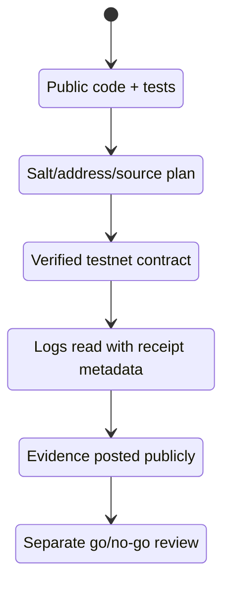
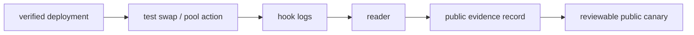

# Public Release Path

The hook repo is the first public technical artifact. The release path must keep that public trust intact.

The principle is simple: each public claim must have matching public evidence.

## Release Ladder

## Phase 1: Reference Repo

Evidence required:

- public GitHub repository;
- MIT license;
- CI passing;
- `forge test` passing;
- clear docs;
- no secrets;
- no production deployment claim.

This repository satisfies Phase 1.

## Phase 2: Base Sepolia Plan

Evidence required:

- chain id;
- PoolManager address;
- init code hash;
- constructor args;
- CREATE2 deployer;
- mined salt;
- computed hook address;
- proof that hook bits match `afterSwap` only;
- source verification plan.

This phase is represented by [BASE_SEPOLIA_PLAN.md](BASE_SEPOLIA_PLAN.md), but it is not complete until the mined address and release record are posted.

## Phase 3: Base Sepolia Deployment

Evidence required:

- deployment transaction hash;
- deployment block;
- verified source link;
- exact compiled source;
- constructor args;
- deployer address;
- deployed bytecode match.

No private key, RPC credential, or signed transaction blob should be committed.

## Phase 4: Reader Evidence

Evidence required:

- reader block range;
- expected hook address;
- observed `AfterSwapObserved` logs;
- observed `FlowPulse` logs;
- decoded sample payload;
- receipt-derived `txHash`;
- receipt-derived `logIndex`;
- finality status.

## Phase 5: Public Canary

The public canary can say:

- the hook code is public;
- the testnet deployment is verified;
- reader evidence exists for observed hook logs;
- the hook returns zero delta;
- receipt metadata is reader-derived.

The public canary must not say:

- production Base mainnet deployment is live;
- funds are protected by an audited production system;
- a production verifier network is live;
- the hook has no risk;
- the hook can know txHash/logIndex during execution.

## Phase 6: Mainnet Candidate

Mainnet is a separate review, not an automatic promotion.

Required before a mainnet claim:

- Base Sepolia release record completed;
- source verification completed;
- reader evidence completed;
- ownership/governance policy reviewed;
- operational incident plan written;
- public docs updated;
- mainnet PoolManager and deployment inputs reviewed;
- explicit go/no-go record.

## Public Language

Acceptable:

> FlowMemory has published its Uniswap v4 afterSwap hook reference implementation. The hook emits FlowPulse memory signals and is designed for a Base Sepolia live path.

Acceptable after Base Sepolia evidence:

> FlowMemory has a verified Base Sepolia hook deployment with observed FlowPulse logs and reader-derived receipt evidence.

Not acceptable yet:

> FlowMemory has a production Base mainnet Uniswap v4 hook.

Not acceptable:

> The hook knows txHash or logIndex during execution.

Not acceptable:

> The hook is audited production custody infrastructure.
