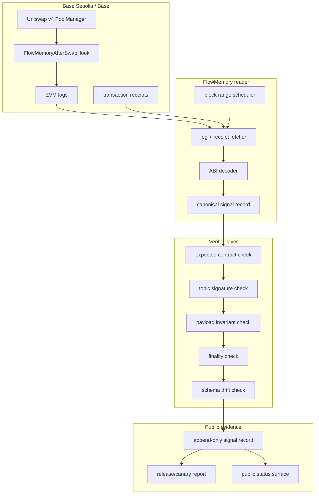
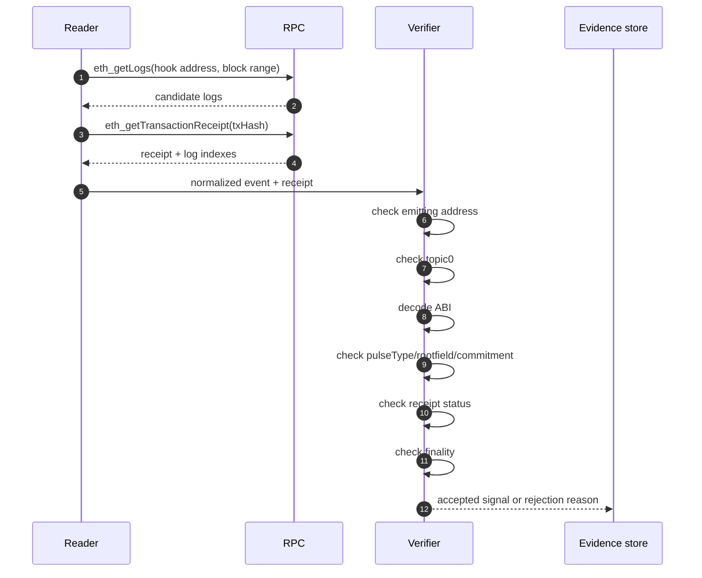
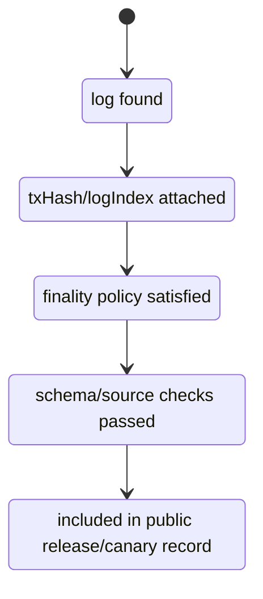

# Reader And Verifier Architecture

The hook emits evidence. It does not complete the full FlowMemory system by itself.

The reader/verifier architecture is the bridge between on-chain logs and a public memory claim. It is also the layer that prevents the project from overstating what the hook can know during EVM execution.

## Architecture Overview



## Reader Inputs

The reader needs:

- chain id;
- RPC endpoint configured outside the repo;
- hook address;
- PoolManager address;
- ABI for `AfterSwapObserved`;
- ABI for `FlowPulse`;
- from-block and to-block;
- finality depth;
- expected event topic hashes;
- expected hook source/version metadata.

No private key is required to read logs.

## Reader Output Shape

A normalized swap-memory signal should preserve both event payload and receipt provenance:

```json
{
  "schema": "flowmemory.uniswap_v4_swap_signal.v0",
  "chainId": "84532",
  "hookAddress": "0x...",
  "poolManager": "0x05E73354cFDd6745C338b50BcFDfA3Aa6fA03408",
  "blockNumber": "0",
  "blockHash": "0x...",
  "txHash": "0x...",
  "transactionIndex": "0",
  "logIndex": "0",
  "receiptStatus": "success",
  "rawLog": {
    "address": "0x...",
    "topics": ["0x..."],
    "data": "0x..."
  },
  "source": {
    "repo": "FlowmemoryAI/flowmemory-uniswap-v4-hooks",
    "commit": "0x...",
    "bytecodeHash": "0x...",
    "abiHash": "0x..."
  },
  "eventName": "FlowPulse",
  "pulseType": "SWAP_MEMORY_SIGNAL",
  "pulseId": "0x...",
  "rootfieldId": "0x...",
  "actor": "0x...",
  "subjectPoolId": "0x...",
  "commitment": "0x...",
  "parentPulseId": "0x...",
  "sequence": "1",
  "occurredAt": "0",
  "uri": "flowmemory://uniswap-v4/after-swap",
  "finality": {
    "status": "pending",
    "confirmations": 0
  }
}
```

The exact schema can evolve, but the split must remain clear:

- event payload comes from the hook log;
- receipt metadata comes from the transaction receipt;
- finality status comes from reader policy.

## Finality Policy

The public status surface should distinguish evidence levels instead of presenting every log as final:

| Status | Meaning |
| --- | --- |
| `observed` | Log was found in a block, but receipt/finality checks are incomplete. |
| `receipt_attached` | Transaction receipt, tx hash, transaction index, and log index are attached. |
| `l2_confirmed` | The log is still on Base/Base Sepolia and has passed the configured L2 confirmation depth. |
| `finalized` | The release policy's finality threshold has been satisfied. |
| `verified` | Finalized evidence also passed schema, source, bytecode, and contract checks. |
| `rejected` | The log or receipt failed a documented check. |

The exact confirmation depth must be written into the release record. Until then, public docs should avoid treating observed logs as final.

## Verification Pipeline



## Required Rejection Reasons

The public reader should produce explicit rejection reasons, not silent drops:

| Reason code | Meaning |
| --- | --- |
| `unexpected_contract` | Log did not come from the expected hook address. |
| `unexpected_topic` | Topic signature is not a known FlowMemory hook event. |
| `decode_failed` | ABI decode failed. |
| `wrong_pulse_type` | `FlowPulse` was not `SWAP_MEMORY_SIGNAL`. |
| `zero_rootfield` | Rootfield id was zero. |
| `zero_commitment` | Commitment was zero. |
| `receipt_missing` | Receipt could not be fetched. |
| `receipt_reverted` | Transaction did not succeed. |
| `below_finality` | Log is visible but not final enough for finalized status. |
| `source_unverified` | Hook source has not been verified for the release record. |

## Public Evidence Levels



## Minimal Reader Pseudocode

```text
for blockRange in plannedRanges:
  logs = eth_getLogs(address = hookAddress, fromBlock, toBlock)

  for log in logs:
    if log.address != hookAddress:
      reject unexpected_contract

    if log.topic0 not in [FLOWPULSE_TOPIC, AFTER_SWAP_OBSERVED_TOPIC]:
      reject unexpected_topic

    receipt = eth_getTransactionReceipt(log.transactionHash)
    if receipt is missing:
      reject receipt_missing

    if receipt.status != 1:
      reject receipt_reverted

    decoded = decode(log)
    if decoded is FlowPulse:
      require decoded.pulseType == SWAP_MEMORY_SIGNAL
      require decoded.rootfieldId != 0
      require decoded.commitment != 0

    finality = classify(blockNumber, currentFinalizedBlock)
    write signal with event payload + receipt metadata + finality
```

## Why This Matters Publicly

The reader is what makes the hook evidence useful to people outside the project. Without it, the hook is only a contract that emits logs. With it, the project can show:

- which swap produced a signal;
- which exact log carried the signal;
- whether the source contract was expected;
- whether the event shape matched the schema;
- whether the signal is pending, finalized, or rejected.

That is the difference between a demo and public evidence.
