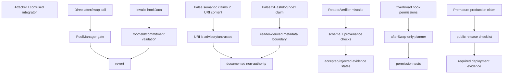

# Security Model

The safest hook is the one that does not pretend to do settlement, custody, routing, accounting, and memory all at once.

FlowMemory's first hook does one thing: emit the memory signal.

This repository is intentionally narrow because the first public primitive should be simple enough for reviewers to understand without trusting private infrastructure.

## Security Goals

| Goal | Mechanism |
| --- | --- |
| Prevent arbitrary callback spoofing | `afterSwap` requires `msg.sender == poolManager`. |
| Keep hook permissions narrow | Planner targets only the `afterSwap` flag. |
| Make memory emission intentional | `hookData`, `rootfieldId`, and `commitment` are required. |
| Avoid token custody risk | The hook has no payable receive path and no asset transfer logic. |
| Avoid custom accounting risk | The hook returns zero hook delta. |
| Avoid fee-policy risk | The hook has no dynamic-fee path. |
| Preserve event honesty | Receipt metadata is reader-derived, not emitted as if the hook knew it. |
| Make launch claims auditable | Public release path requires deployment and reader evidence. |

## What The Hook Is Not

- The hook is not a custody surface.
- The hook is not a balance-changing surface.
- The hook is not an accounting engine.
- The hook is not a fee engine.
- The hook is not a routing engine.
- The hook is not a swap-control engine.
- The hook is a memory-signal emission surface.

## Rootfield Authorization Boundary

The hook validates that `rootfieldId` and `commitment` are non-zero. It does not prove that the swap sender is authorized to write to a rootfield, that a parent pulse exists, or that a commitment points to a semantically valid artifact.

That is intentional for this first memory-native hook primitive. Rootfield authorization and commitment semantics are reader/verifier policy unless a later contract adds explicit on-chain authorization.

Public evidence must distinguish:

- hook-level validity: the callback was well-formed and emitted the expected events;
- reader-level validity: the log came from the expected contract and receipt;
- FlowMemory-level validity: the rootfield, commitment, and parent relationship are accepted by policy.

## Threat Model

## On-Chain Invariants

The hook must preserve these properties:

1. Only the configured `PoolManager` can invoke the callback successfully.
2. `sender` cannot be zero.
3. `hookData` cannot be empty.
4. `rootfieldId` cannot be zero.
5. `commitment` cannot be zero.
6. Valid swaps emit `AfterSwapObserved`.
7. Valid swaps emit `FlowPulse`.
8. `afterSwap` returns the v4 callback selector and zero hook delta.
9. The hook has no token-transfer path.
10. The hook has no dynamic-fee path.
11. The hook has no routing path.
12. The hook does not emit `txHash` or `logIndex` as if it knew them during execution.

## Off-Chain Invariants

Readers and verifiers must preserve these properties:

1. Only accept logs from the expected hook address.
2. Check event topic signatures.
3. Decode `FlowPulse` according to the committed schema.
4. Require `pulseType == SWAP_MEMORY_SIGNAL` for swap memory.
5. Attach `txHash`, `transactionIndex`, and `logIndex` from receipts.
6. Apply a finality policy before presenting evidence as finalized.
7. Preserve raw log provenance for audit.
8. Treat `uri` as advisory metadata, not trusted truth.

## Biggest Risks

The biggest risks are not hidden swap control paths. The hook does not have those.

The biggest risks are:

- malformed `hookData`;
- false semantic claims in URI content;
- reader or verifier mistakes;
- deployment misconfiguration;
- stale upstream Uniswap assumptions;
- overclaiming before release evidence exists.

## Failure Modes

| Failure mode | Expected behavior |
| --- | --- |
| Wrong caller invokes `afterSwap` | Revert with `UnauthorizedPoolManager`. |
| Zero sender | Revert with `ZeroSender`. |
| Empty hook data | Revert with `EmptyHookData`. |
| Malformed hook data | Revert during ABI decode. |
| Zero rootfield id | Revert with `ZeroRootfieldId`. |
| Zero commitment | Revert with `ZeroCommitment`. |
| Reader sees unfinalized logs | Keep status pending until finality policy is met. |
| Reader cannot fetch receipt | Do not claim txHash/logIndex-derived evidence. |
| Source verification missing | Do not call deployment public-ready. |

## What Reviewers Should Look For

Reviewers should start with:

- `contracts/FlowMemoryAfterSwapHook.sol`;
- `contracts/FlowMemoryHookPlanner.sol`;
- `contracts/FlowPulse.sol`;
- `test/FlowMemoryAfterSwapHook.t.sol`;
- `docs/PUBLIC_RELEASE_PATH.md`.

Key questions:

- Does the hook mutate token balances? It should not.
- Does the hook alter fees? It should not.
- Does the hook route swaps? It should not.
- Does the hook return non-zero delta? It should not.
- Does the hook claim to know receipt metadata? It should not.
- Does the release record show real deployment and reader evidence? It must before live claims.

## Non-Goals

The public hook primitive does not claim:

- audited production readiness;
- production Base mainnet deployment;
- governance completeness;
- multisig completeness;
- verifier-network completeness;
- tokenomics;
- custody;
- dynamic fees.

Those may become future workstreams, but they are outside this first public hook surface.
