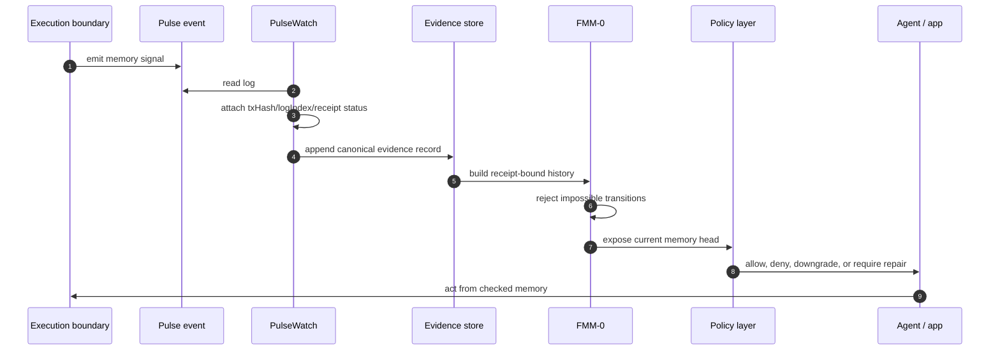
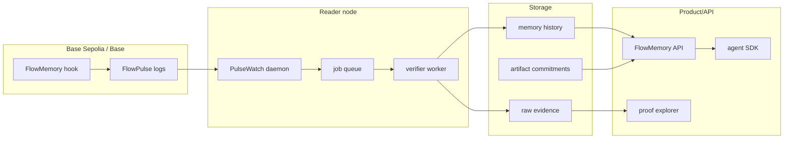

# FlowMemory System Architecture

FlowMemory is a receipt-bound memory system for autonomous execution.

The simple version:

```text
Execution happens.
A boundary emits a pulse.
A reader proves where it landed.
A memory model checks whether the resulting machine history could have happened.
Agents, compute systems, and commerce flows act from that checked memory.
```

The Uniswap v4 hook is the first public boundary. It is not the whole system.
It is the smallest on-chain place where the architecture becomes real.

## Plain-Language Map

| FlowMemory term | Simple meaning |
| --- | --- |
| `FlowPulse` | A memory signal emitted at a known execution boundary. |
| transaction proof envelope | The receipt and log facts proving where the pulse landed. |
| `rootfieldId` | The memory thread or domain being advanced. |
| `commitment` | A hash-like pointer to the downstream memory artifact. |
| PulseWatch | The always-on reader that watches chain events 24/7. |
| FMM-0 | The local memory model that rejects impossible machine histories. |
| FlowSerial | The ordering check for receipt-bound machine histories. |
| SpendLine | The check that an autonomous spend belongs to the current memory history. |
| DischargeLine | The check that a payment receipt closes the right obligation. |
| Obligation Membrane | The check that delegation cannot launder away constraints. |
| PolicyCard | A user or protocol rule for what an agent may do from a memory head. |
| PulsePermit | A pre-action permit bound to policy, actor, action intent, and memory head. |
| OutcomePulse | A post-action settlement record linked to receipt evidence. |
| PulsePass | A portable scoped claim a user can carry without exposing the whole history. |

## Category Position

Most systems in crypto and AI record activity after the fact.

FlowMemory treats memory as a protocol surface:

```text
execution boundary -> pulse -> receipt evidence -> memory consistency -> usable machine memory
```

The category is not "more logs." The category is receipt-bound memory.

For DeFi:

```text
The swap is not the memory.
The transaction is the proof envelope.
The FlowPulse is the memory artifact.
```

For agents:

```text
The wallet action is not the memory.
The receipt is the proof envelope.
The checked history is the memory the agent can act from.
```

For compute:

```text
The GPU job is not the memory.
The compute receipt is the proof envelope.
The ComputePulse is the reusable memory artifact.
```

## Architecture Principles

1. **Boundaries emit, readers prove.**
   Hooks and adapters emit pulses. They do not invent receipt metadata.

2. **Memory is not analytics.**
   A FlowPulse is intentionally emitted from a declared boundary. It is not a
   dashboard summary, transaction scraping, or a post-hoc narrative.

3. **The always-on system is off-chain.**
   A Uniswap v4 hook runs only during transactions. PulseWatch and future
   reader/verifier services run continuously.

4. **Action must cite memory.**
   Agent spend, compute reuse, obligation discharge, and delegated work should
   reference the memory head they claim to extend.

5. **Memory should gate before and settle after.**
   A useful agent system needs pre-action memory checks and post-action receipt
   settlement. The missing product loop is `PolicyCard -> PulsePermit ->
   ActionPulse -> FlowPulseLink -> OutcomePulse -> PulsePass`.

6. **Impossible histories are product features.**
   FlowMemory is useful because it rejects histories ordinary logs can make
   look acceptable: stale memory heads, double discharge, receipt smuggling,
   unsafe reuse, and delegation laundering.

7. **Small surfaces beat giant trusted runtimes.**
   The hook does one thing. The reader does one thing. Each conformance layer
   has a named invariant and a reproducible local harness.

## Full Stack

```mermaid
flowchart TB
    subgraph Boundary["Execution Boundary Layer"]
        Uni["Uniswap v4 afterSwap hook"]
        Compute["Compute job boundary"]
        Commerce["Agent wallet/payment boundary"]
        Api["API/service boundary"]
    end

    subgraph Pulse["Pulse Emission Layer"]
        FlowPulse["FlowPulse"]
        ComputePulse["ComputePulse"]
        AgentPulse["Agent / commerce pulse"]
        Commitment["rootfield + commitment + parent"]
    end

    subgraph Reader["24/7 Reader Layer"]
        Watch["PulseWatch"]
        Receipt["receipt attachment"]
        Cursor["cursor + dedupe"]
        Finality["finality classification"]
    end

    subgraph Evidence["Evidence Layer"]
        Raw["append-only raw evidence"]
        Canonical["canonical pulse records"]
        Release["release/canary packets"]
        Explorer["proof explorer"]
    end

    subgraph Memory["Memory Model Layer"]
        FMM["FMM-0"]
        Serial["FlowSerial"]
        MMU["FlowMMU"]
        Quiesce["FlowQuiesce"]
        Retire["PulseRetire"]
        Fission["BoundaryFission"]
    end

    subgraph Policy["Policy And Action Layer"]
        Card["PolicyCard"]
        Permit["PulsePermit"]
        Writ["AxiomWrit"]
        Patch["AxiomPatch"]
        Action["ActionPulse"]
        Spend["SpendLine"]
        Discharge["DischargeLine"]
        Duplex["DuplexLine"]
        Conservation["Agent Commerce Conservation"]
        Membrane["Obligation Membrane"]
        Outcome["OutcomePulse"]
        Pass["PulsePass"]
    end

    subgraph Products["Product Surfaces"]
        SDK["SDK / API"]
        Dashboard["public explorer"]
        AgentRuntime["agent runtime adapters"]
        ComputeRouter["compute reuse router"]
    end

    Boundary --> Pulse
    Pulse --> Reader
    Reader --> Evidence
    Evidence --> Memory
    Memory --> Policy
    Policy --> Products
```



## Receipt Runtime Loop

The hook proves FlowMemory can emit a signal.

The receipt runtime proves why the signal matters:


This is the product loop the architecture review identified as the missing primitive. FlowMemory is
not only "watch what happened." It is "act only from the right memory head, then
settle the result against receipt-bound evidence."

Run the local architecture MVP:

```bash
python tools/receipt_runtime_demo.py --pretty
```

The demo shows a cheap provider losing to a private bonded provider because raw
price is not enough. The selected route is the cheapest route that can produce
a policy-safe receipt-bound outcome.

## Runtime Data Flow



## Control Plane

The data plane records memory. The control plane decides when a system may act
from memory.

```text
policy card
  -> allowed boundary types
  -> required memory phase
  -> required proof envelope level
  -> allowed compute reuse mode
  -> allowed spend/discharge conditions
  -> repair or refusal policy
```

The future production control plane should include:

- policy registry;
- rootfield registry;
- allowed boundary adapters;
- release/evidence registry;
- API keys and rate limits;
- incident owner and rollback procedure;
- per-rootfield SLOs for reader lag and evidence freshness.

## State Stores

| Store | Contents | Rule |
| --- | --- | --- |
| Raw evidence store | Logs, receipts, block facts, source metadata. | Append-only; never rewrite chain facts. |
| Canonical pulse store | Normalized FlowPulse/ComputePulse/AgentPulse records. | Deduped by proof-envelope identity. |
| Memory history store | FMM-0 histories, roots, heads, faults, repairs. | Deterministic from canonical evidence. |
| Artifact store | Off-chain payloads referenced by commitments and URIs. | URI content is advisory unless separately verified. |
| Policy store | PolicyCards, AxiomWrits, AxiomPatches, obligations. | Versioned; changes must be explainable. |
| Release store | Public canary and release packets. | Claim-gated before publication. |

## Component Responsibilities

| Component | Owns | Does not own |
| --- | --- | --- |
| Uniswap hook | On-chain FlowPulse emission after `afterSwap`. | 24/7 execution, custody, swap control, receipt facts. |
| PulseWatch | Continuous log polling, receipt attachment, cursor state, dedupe. | Private keys, semantic truth, production finality guarantees by itself. |
| Verifier | Contract, schema, topic, finality, source, and payload checks. | Rewriting payloads or pretending bad evidence is valid. |
| FMM-0 | Admissible machine-history checks. | Model correctness, work quality, or semantic truth. |
| Agent commerce harnesses | Spend, discharge, exchange, conservation, and delegation invariants. | Wallet authorization, escrow, or fund protection. |
| Compute harnesses | Reuse, billing-route, cache-lineage, and attestation-reference checks. | GPU hardware acceleration or CUDA optimization. |
| Public explorer | Human-readable proof surface. | Creating evidence that was not observed. |
| Future SDK/API | Developer integration. | Hiding proof boundaries from developers. |
| Receipt Runtime | Gate action with `PulsePermit`, settle with `OutcomePulse`, and produce private `PulsePass` claims. | Wallet authorization, escrow, or proof that the action was economically good. |

## Deployment Topology



## Build From Scratch

### Phase 0: Public Boundary

Goal: make the first boundary credible.

- Ship `FlowMemoryAfterSwapHook`.
- Keep hook permissions afterSwap-only.
- Emit `FlowPulse`.
- Preserve receipt separation.
- Publish local tests and reviewer docs.

Exit criteria:

- `forge test -vvv` passes.
- FlowPulse schema excludes `txHash`, `transactionIndex`, and `logIndex`.
- claim gate reports zero unguarded overclaims.

### Phase 1: Always-On Evidence

Goal: prove the system is more than a transaction callback.

- Run PulseWatch as the 24/7 reader.
- Maintain cursor state.
- Attach receipt metadata.
- Write append-only memory records.
- Publish Base Sepolia release evidence when real observed logs exist.

Exit criteria:

- PulseWatch daemon runs under a process supervisor.
- reader lag is measured.
- release evidence packet validates.
- public docs distinguish observed, receipt-attached, finalized, and verified.

### Phase 2: Memory Core

Goal: make machine memory checkable.

- Promote FMM-0 from local harness to shared core package.
- Define rootfield heads, memory phases, and forbidden transitions.
- Keep FlowSerial, FlowMMU, FlowQuiesce, PulseRetire, and BoundaryFission as
  separate modules with clear APIs.

Exit criteria:

- each memory module has fixtures, tests, and a typed output schema;
- impossible histories shrink to readable forbidden cores;
- valid histories compose without drift.

### Phase 3: Agent Commerce

Goal: make autonomous commerce memory-consistent.

- Implement the receipt runtime MVP: `PolicyCard`, `PulsePermit`,
  `ActionPulse`, `FlowPulseLink`, `OutcomePulse`, and `PulsePass`.
- Implement SpendLine, DischargeLine, DuplexLine, Agent Commerce Conservation,
  and Obligation Membrane as package APIs.
- Treat wallets and payment rails as external systems.
- Make every accepted action cite a current memory head.

Exit criteria:

- stale head, duplicate intent, wrong discharge, orphan work/payment, and
  delegation laundering cases are rejected in deterministic tests;
- cheap-but-unsafe routes lose to the lowest cost-per-success route;
- scoped PulsePass claims hide provider and transaction identifiers unless
  explicitly disclosed;
- API returns allow/deny/repair outcomes with reason codes.

### Phase 4: Compute Memory

Goal: make GPU/AI compute reusable without pretending FlowMemory speeds up
hardware.

- Implement ComputePulse, Cache Lineage Gate, Compute Reuse Router, and Compute
  ChargeLine as the compute-memory path.
- Store commitments and lineage, not GPU memory contents.
- Price or route reuse differently from fresh compute.

Exit criteria:

- safe reuse is accepted;
- unsafe reuse, runtime drift, stale buyer memory, missing attestation
  references, and fresh/reuse billing mismatch are rejected.

### Phase 5: Developer Product

Goal: make the system usable by one-person startup customers and developers.

- Ship a proof explorer.
- Ship SDKs for reading memory heads and submitting commitments.
- Ship templates for agent policy cards and commerce obligations.
- Publish a small number of high-quality demos instead of a broad unfinished
  platform.

Exit criteria:

- a developer can follow one path from action to pulse to proof to memory check;
- every public demo has a command and expected output;
- every marketing claim has a matching evidence artifact.

### Phase 6: Production Operations

Goal: make the public system maintainable.

- Reader nodes have health checks, alerting, retry policy, and backfill policy.
- Evidence stores are backed up.
- Deployment records are versioned.
- Incident response has an owner and a claim-drift procedure.
- Public releases are gated by evidence.

Exit criteria:

- operator can replay from block N;
- corrupted or missing evidence produces a visible degraded status;
- no public page silently upgrades pending evidence into verified evidence.

## Package Boundary

This repo should remain the public hook and local conformance launch repo.

Recommended package split:

| Package | Purpose |
| --- | --- |
| `flowmemory-uniswap-v4-hooks` | Public Uniswap v4 FlowPulse boundary and local conformance evidence. |
| `flowmemory-core` | Shared schemas, rootfields, commitments, FMM-0, FlowSerial, and evidence types. |
| `flowmemory-reader` | PulseWatch daemon, RPC readers, finality policy, release evidence writers. |
| `flowmemory-agent-commerce` | SpendLine, DischargeLine, DuplexLine, Conservation, Membrane APIs. |
| `flowmemory-compute` | ComputePulse, cache lineage, compute reuse, and charge routing. |
| `flowmemory-warranted-agents` | PolicyCards, FlowBond, PulsePass, adapters, and agent-facing conformance. |
| `flowmemory-explorer` | Public proof explorer and launch canary surface. |

## One-Person Startup Build Order

The highest-leverage build path is:

1. Keep this hook repo clean and reviewable.
2. Run PulseWatch against real Base Sepolia evidence.
3. Build a tiny proof explorer that shows one FlowPulse proof envelope.
4. Build the receipt runtime loop: PolicyCard, PulsePermit, OutcomePulse, and
   PulsePass.
5. Extract `flowmemory-core` only when two repos need the same types.
6. Productize one agent-commerce use case: memory-consistent API payment or
   compute purchase.
7. Productize one compute use case: safe cache/compute reuse with proof.
8. Add paid developer API only after evidence ingestion and replay are stable.

Do not start with a giant runtime. Start with a boundary people can inspect and
a proof trail they can understand.

## Security And Trust Boundaries

The production design must keep these lines clear:

- no custody claim;
- no escrow claim;
- no fund-protection claim;
- no wallet-authorization claim;
- no hook-time receipt metadata claim;
- no semantic-truth claim;
- no model-correctness claim;
- no GPU hardware acceleration claim;
- no live Base mainnet claim without release evidence.

FlowMemory's security posture comes from narrowing the surface and making every
accepted memory transition replayable.

## Senior-Reviewer Questions

Use these questions to pressure-test the architecture:

1. Can every public memory claim point to a receipt or a local deterministic
   fixture?
2. Can the reader replay from genesis or a release start block and reproduce
   the same memory heads?
3. Can a malicious URI claim false content without corrupting the memory model?
4. Can an agent spend from a stale memory head?
5. Can compute reuse be charged as fresh compute?
6. Can an obligation be discharged by the wrong receipt?
7. Can a child agent hide a refusal or downgrade a parent constraint?
8. Can public copy claim more than the evidence proves?
9. Can a cheap provider win despite failing the user's PolicyCard?
10. Can a PulsePass reveal only a useful predicate without exposing the whole
    receipt history?

The architecture is ready when these questions have commands, reason codes, and
expected outputs.
