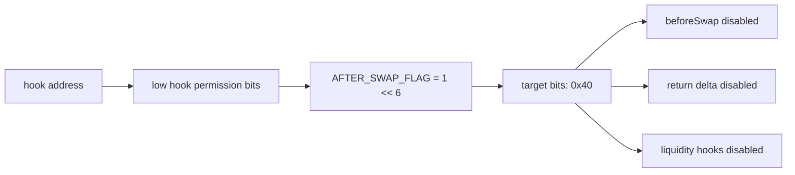

# Uniswap V4 Compatibility

This repo keeps the memory-native hook primitive dependency-light, but the public release still needs to prove compatibility with Uniswap v4 concepts and ABI expectations.

The design should be reviewed against the official Uniswap v4 docs before each live release.

## Compatibility Scope

| Area | FlowMemory implementation | Compatibility note |
| --- | --- | --- |
| Hook lifecycle point | `afterSwap` | Matches the Uniswap v4 swap hook lifecycle point. |
| Hook permission bits | `AFTER_SWAP_FLAG = 1 << 6` | Address mining must produce low hook bits `0x40`. |
| PoolManager gate | Constructor-configured `poolManager` | Callback only succeeds when `msg.sender` is the configured PoolManager. |
| Pool key | ABI-compatible primitive struct | Used to derive `poolId` with `keccak256(abi.encode(...))`. |
| Swap params | ABI-compatible primitive struct | Captures `zeroForOne`, `amountSpecified`, and `sqrtPriceLimitX96`. |
| Balance delta | `int256 swapDelta` primitive | Dependency-light representation of the callback delta value. |
| Return value | `(bytes4 selector, int128 hookDelta)` | Returns the callback selector and zero hook delta. |

## Minimal Interface

The repo intentionally defines:

```solidity
interface IUniswapV4SwapHookLike {
    struct PoolKey {
        address currency0;
        address currency1;
        uint24 fee;
        int24 tickSpacing;
        address hooks;
    }

    struct SwapParams {
        bool zeroForOne;
        int256 amountSpecified;
        uint160 sqrtPriceLimitX96;
    }

    function afterSwap(
        address sender,
        PoolKey calldata key,
        SwapParams calldata params,
        int256 swapDelta,
        bytes calldata hookData
    ) external returns (bytes4 selector, int128 hookDelta);
}
```

This is not a claim that the repo vendors the full Uniswap v4 core. It is a narrow compatibility surface used for the public hook primitive and tests.

Before a live deployment, the release record should identify the exact upstream `v4-core`/`v4-periphery` version or commit used for final integration review.

## Permission Bits



The planner rejects candidate addresses unless:

```text
uint160(hookAddress) & ((1 << 14) - 1) == 0x40
```

## Pool ID Derivation

The reference hook derives the pool id as:

```solidity
keccak256(abi.encode(key.currency0, key.currency1, key.fee, key.tickSpacing, key.hooks))
```

The public reader/verifier should use the same derivation when interpreting hook evidence.

## Compatibility Risks

| Risk | Mitigation |
| --- | --- |
| Minimal interface drifts from upstream v4 ABI | Pin upstream v4-core/v4-periphery version in the release record and add ABI compatibility checks before deployment. |
| Stale deployment address | Re-check official Uniswap deployments before broadcast. |
| Incorrect hook permission bits | Use CREATE2 planning and test the low hook bits. |
| Misunderstood `sender` | Treat it as the PoolManager callback sender, often a router or contract, not necessarily a trader EOA. |
| Misused return delta | Keep hook delta zero for this release path. |

## Required Pre-Deployment Compatibility Checklist

- [ ] Re-check official Uniswap v4 deployments for target chain.
- [ ] Record exact upstream v4-core/v4-periphery version or commit.
- [ ] Confirm `afterSwap` selector.
- [ ] Confirm hook permission flag mapping.
- [ ] Confirm PoolKey field order and ABI layout.
- [ ] Confirm SwapParams field order and ABI layout.
- [ ] Confirm BalanceDelta handling for final integration package.
- [ ] Confirm computed hook address has exactly `0x40` low hook bits.
- [ ] Confirm source verification includes the final integration source.
