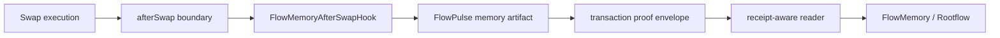
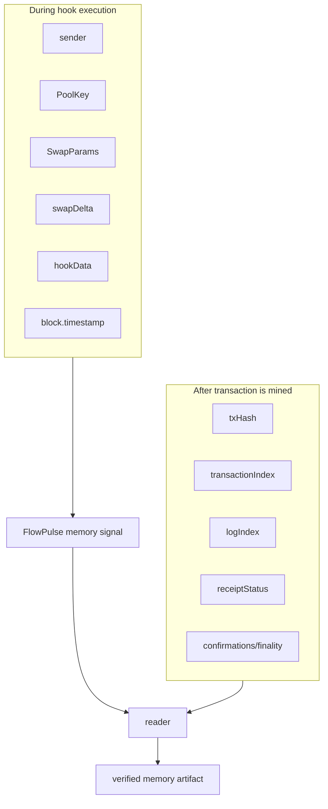

# Why This Creates A New Primitive

FlowMemory works because it uses Uniswap v4 hooks for a new purpose: not to change execution, but to emit memory from a verified execution boundary.

Most hooks ask: how can we change what the swap does?

FlowMemory asks: what should the system remember once execution has happened?

Most hooks modify execution. FlowMemory emits memory.

## The Core Idea

After a swap reaches the `afterSwap` lifecycle point, the hook emits a FlowPulse memory signal.

That signal says:

- a swap reached the configured `afterSwap` boundary;
- the callback came from the configured PoolManager;
- a FlowMemory `rootfieldId` was referenced;
- an opaque `commitment` was attached;
- a FlowPulse memory artifact was emitted into the transaction proof envelope;
- a reader can attach receipt facts later.

The swap transaction is not the memory. The transaction is the proof envelope. The FlowPulse is the memory artifact.

## Category Claim

FlowMemory is introducing a new category of Uniswap v4 hook: the memory-signal hook.

Traditional hook categories focus on execution changes: fees, routing, incentives, liquidity behavior, accounting, or trading mechanics.

FlowMemory's hook is different.

It is designed around verifiable memory emission.

The hook does not try to make the swap cheaper, faster, or more complex.

It makes the execution boundary memorable.

## Why `afterSwap`

`afterSwap` is the right first hook point because FlowMemory wants to emit memory after the swap lifecycle boundary exists, not decide whether a swap should happen.

Here "after" means after the swap operation inside the PoolManager lifecycle. It does not mean the transaction is finalized, irreversible, or already indexed. Finality is a reader/verifier concern after the transaction is mined.

| Hook point | Public first-release fit | Reason |
| --- | --- | --- |
| `beforeSwap` | Poor | Invites pre-execution control logic and policy ambiguity. |
| `afterSwap` | Strong | Gives a post-swap lifecycle boundary for memory emission. |
| liquidity hooks | Later | Useful eventually, but not required for swap memory signals. |
| donate hooks | Later | Not part of the first memory-signal path. |
| return-delta hooks | Avoid for first release | Adds custom accounting complexity. |

FlowMemory does not need to control the swap to make the moment memorable.

## Why Event-First Is Better

An event-first hook is better for this primitive because the signal is memory, not settlement.

| Design choice | Why it helps |
| --- | --- |
| Emit `FlowPulse` | Creates a standard memory signal stream that readers can index and verify. |
| Store only per-rootfield sequence | Keeps on-chain state minimal. |
| Return zero hook delta | Avoids custom accounting and balance side effects. |
| No token custody | Reduces asset-risk surface. |
| No dynamic fees | Keeps the hook from becoming a fee-policy contract. |
| Reader-derived receipt metadata | Keeps on-chain claims honest about what the EVM can know. |

The hook being narrow is a feature.

There is one important consequence: invalid or missing FlowMemory `hookData` reverts the hook callback, which reverts the swap transaction path using that hook. The hook is not a pricing or fee-policy gate, but it is a validity gate for the FlowMemory memory payload.

## Why Receipt Metadata Is Not In The Hook

During contract execution, the hook does not know the final transaction hash, transaction index, or log index. Those are receipt-level facts.

So FlowMemory separates the layers:

This is a core credibility point. The public docs must never imply that the hook can know receipt metadata while it is running.

## Why This Is Better Than A Generic Hook Demo

Generic hook demos show that a hook can run. FlowMemory's public hook repo shows a new primitive:

1. The hook permission surface is deliberately small.
2. The emitted event has a stable memory-signal schema.
3. The tests prove the critical invariants.
4. The release path requires public evidence before live claims.
5. The design does not hide risk behind broad "custom logic" language.

Execution already exists. Memory is the missing layer.

## What It Does Not Prove Yet

The current repo does not prove:

- a live Base Sepolia deployment exists;
- a Base mainnet deployment exists;
- a verifier network is production-ready;
- a pool has adopted the hook;
- all FlowMemory / Rootflow downstream systems are live.

Those claims require release records and live evidence. See [PUBLIC_RELEASE_PATH.md](PUBLIC_RELEASE_PATH.md).
