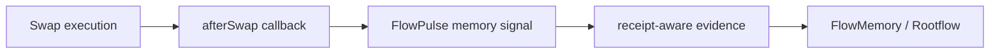
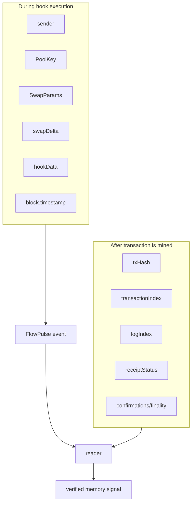

# Why This Works

This design works because it uses Uniswap v4 hooks for the thing hooks are good at: running small, deterministic logic at a defined point in a pool lifecycle.

FlowMemory does not ask the hook to become a database, custodian, oracle, verifier network, or fee engine. It uses the hook as a public signal boundary.

## The Core Idea

After a swap completes, the hook emits a memory signal.

That signal says:

- a swap reached the `afterSwap` lifecycle point;
- the hook was called by the configured `PoolManager`;
- a FlowMemory `rootfieldId` was referenced;
- a commitment was attached;
- the event can be read from the transaction receipt later.

The design is useful because it turns market activity into a verifiable memory event without making the hook responsible for the rest of the protocol.

## Why `afterSwap`

`afterSwap` is the right first hook point because FlowMemory wants to observe completed swap activity, not decide whether a swap should happen.

Here "after" means after the swap operation inside the PoolManager lifecycle. It does not mean the transaction is finalized, irreversible, or already indexed. Finality is a reader/verifier concern after the transaction is mined.

| Hook point | Public first-release fit | Reason |
| --- | --- | --- |
| `beforeSwap` | Poor | Invites pre-execution control logic and policy ambiguity. |
| `afterSwap` | Strong | Gives a post-swap observation point for evidence emission. |
| liquidity hooks | Later | Useful eventually, but not required for swap memory signals. |
| donate hooks | Later | Not part of the first memory-signal path. |
| return-delta hooks | Avoid for first release | Adds custom accounting complexity. |

The first public surface should be narrow enough that reviewers can reason about it quickly.

## Why Event-First Is Better

An event-first hook is better for this use case than a state-heavy hook because the signal is evidence, not settlement.

| Design choice | Why it helps |
| --- | --- |
| Emit `FlowPulse` | Creates a standard log stream that readers can index and verify. |
| Store only per-rootfield sequence | Keeps on-chain state minimal. |
| Return zero hook delta | Avoids custom accounting and balance side effects. |
| No token custody | Reduces asset-risk surface. |
| No dynamic fees | Keeps the hook from becoming a fee-policy contract. |
| Reader-derived receipt metadata | Keeps on-chain claims honest about what the EVM can know. |

This does not make the hook magical. It makes the hook auditable.

There is one important consequence: invalid or missing FlowMemory `hookData` reverts the hook callback, which reverts the swap transaction path using that hook. The hook is not a pricing or fee-policy gate, but it is a validity gate for the FlowMemory memory payload.

## Why Receipt Metadata Is Not In The Hook

During contract execution, the hook does not know the final transaction hash, transaction index, or log index. Those are receipt-level facts.

So FlowMemory separates the layers:

This is a core credibility point. The public docs should not imply that the hook can know receipt metadata while it is running.

## Why This Is Better Than A Generic Hook Demo

Generic hook demos often show that a hook can run. FlowMemory's public hook repo is trying to show something stricter:

1. The hook permission surface is deliberately small.
2. The emitted event has a stable schema.
3. The tests prove the critical invariants.
4. The release path requires public evidence before live claims.
5. The design does not hide risk behind broad "custom logic" language.

## Why This Is Better Than A Private Demo

A private demo asks people to trust a claim. A public hook repo gives them a way to inspect the claim.

Public reviewers can check:

- the exact callback ABI;
- the permission bits;
- the PoolManager gate;
- the emitted event topics;
- the absence of custody/fee/custom-accounting paths;
- the test suite;
- the Base Sepolia release requirements.

That is the right first artifact to share because it is not dependent on the full FlowMemory system being public or finished.

## What It Does Not Prove Yet

The current repo does not prove:

- a live Base Sepolia deployment exists;
- a Base mainnet deployment exists;
- a verifier network is production-ready;
- a pool has adopted the hook;
- all FlowMemory/Rootflow downstream systems are live.

Those claims require release records and live evidence. See [PUBLIC_RELEASE_PATH.md](PUBLIC_RELEASE_PATH.md).
